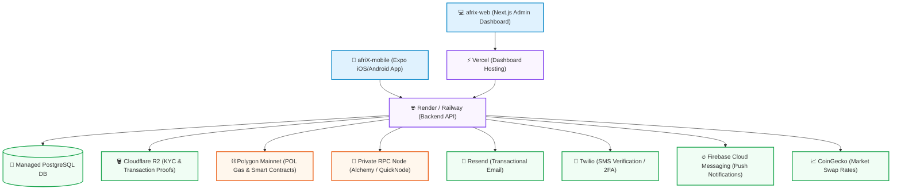

# Production Resource & Budget Guide – AfriExchange (AfriX)

This guide details all the infrastructure, services, and third-party resources required to run **AfriExchange (AfriX)** in production. It highlights active free tiers, recommended upgrades, pricing structures, and best practices to manage your budget as you scale.

---

## 🏗️ Production Architecture & Integrations

The diagram below shows how the AfriX components interact with external cloud services, blockchain networks, and communication providers in a live production environment.

---

## 📊 Summary of Production Costs

Here is a quick overview of the hosting, database, blockchain, storage, and communication services required to launch AfriX, along with their pricing tiers.

| Resource Category | Service Provider | Production Tier | Monthly Cost (Launch/Idle) | Upgrade Trigger | Projected Cost (Scaled) |
| :--- | :--- | :--- | :--- | :--- | :--- |
| **Backend API Hosting** | [Render](https://render.com) / [Railway](https://railway.app) | Web Service (Starter) | **~$7.00 / month** | CPU/RAM limits exceeded or latency spikes | **~$25.00+ / month** |
| **Database** | Render / Railway / [Neon](https://neon.tech) | Managed PostgreSQL | **~$7.00 - $10.00 / month** | Storage > 1GB or high active read/write loads | **~$30.00+ / month** |
| **Admin Web Dashboard** | [Vercel](https://vercel.com) | Pro Team | **$20.00 / month** | Required for Team ownership, custom domains, and timeouts | **$20.00 / month** (per developer) |
| **Custom Domain** | e.g. Namecheap / Cloudflare | Purchased | **~$1.50 / month** *(Paid annually: $10 - $20)* | Annual renewal | **~$1.50 / month** |
| **KYC & Proof Storage** | [Cloudflare R2](https://www.cloudflare.com/developer-platform/r2/) | Free Tier | **$0.00** | Storage > 10GB or > 1M Class A operations | **$0.015 / GB** per month *(No egress fees)* |
| **Blockchain Gas (Polygon)** | Polygon Mainnet | On-Chain Wallet | **Usage-based** *(~$10 - $20 initial buffer)* | High volume of smart contract escrows/swaps | **Pay-as-you-go** *(~$0.005 - $0.05 per tx)* |
| **Blockchain RPC Node** | [Alchemy](https://www.alchemy.com) / [QuickNode](https://www.quicknode.com) | Free Tier | **$0.00** | Compute Units > 3 Million/month | **$49.00 / month** (Alchemy Growth) |
| **Developer App Stores** | Apple & Google | Developer Accounts | **~$10.00 / month** *(Apple: $99/yr, Google: $25 one-time)* | Recurring annual fee (Apple) | **~$10.00 / month** |
| **Transactional Emails** | [Resend](https://resend.com) | Free Tier | **$0.00** | Emails > 3,000/month or > 100/day | **$20.00 / month** (Resend Pro) |
| **SMS & 2FA (Twilio)** | [Twilio](https://www.twilio.com) | Pay-as-you-go | **$0.00** *(Only pays per SMS sent)* | High user registration & 2FA login volume | **~$0.05 - $0.10 / SMS** (varies by country) |
| **Push Notifications** | [Firebase (FCM)](https://firebase.google.com) | Free Tier | **$0.00** | FCM is free; OneSignal (alternative) > 10k users | **$9.00 - $99.00 / month** (OneSignal) |
| **Exchange Rate API** | [CoinGecko](https://www.coingecko.com) | Demo Free Tier | **$0.00** | Rate limits exceeded (30 calls/minute) | **$129.00 / month** (Analyst Plan) |
| **TOTAL** | — | — | **~$45.50 - $58.50 / month** | — | **~$180.00+ / month** *(+ usage-based SMS/Gas)* |

---

## 🛡️ Detailed Resource Breakdown

### 1. Backend API Hosting: Render or Railway
The backend running in [afriX_backend](file:///Users/harz/Documents/backUps/izmir/AfriExchange/afriX_backend) uses Express 5, Node.js, and Sequelize ORM. It runs background cron jobs (e.g. `expireRequests.js`) to expire PENDING mints, refund expired ESCROWED burns, and open auto-disputes.

*   **Production Tier Recommended**: 
    *   **Render Starter Web Service ($7/month)** or **Railway Developer Plan (Usage-based, min $5/month)**.
*   **Why it is needed in production**:
    *   **Zero Sleep / Always On**: Unlike the free tiers, production plans do not sleep due to inactivity, ensuring that the backend is always awake to process webhooks (e.g., merchant payments) and cron jobs.
    *   **Resource Allocation**: Higher memory and CPU limits avoid Out-Of-Memory (OOM) crashes during concurrent on-chain events.
*   **Key Environment Variables**:
    *   `PORT=10000`, `NODE_ENV=production` (configured in [Deployment_Guide.md](file:///Users/harz/Documents/backUps/izmir/AfriExchange/Deployment_Guide.md)).

---

### 2. Database: Managed PostgreSQL (Render / Railway / Neon)
The application relies on PostgreSQL to store users, wallets, transaction histories, agents, merchants, KYC data, escrows, and quiz records.

*   **Production Tier Recommended**: 
    *   **Render PostgreSQL Starter ($7/month)** or **Railway PostgreSQL ($10/month)**.
*   **Why it is needed in production**:
    *   **SSL Support**: Production databases require active SSL configurations. The system handles SSL automatically if configured via `DATABASE_URL` or `DB_SSL=true`.
    *   **Automated Backups**: Regular backup points are essential to recover financial and user ledger records in case of emergency.
    *   **No Expiry**: Free plans automatically delete databases or suspend them after 30 days of inactivity.
*   **Key Environment Variables**:
    *   `DATABASE_URL` (starts with `postgresql://...`) or individual `DB_HOST`, `DB_PORT`, `DB_NAME`, `DB_USER`, `DB_PASSWORD`, `DB_SSL=true`. Refer to [RAILWAY_SETUP.md](file:///Users/harz/Documents/backUps/izmir/AfriExchange/RAILWAY_SETUP.md) for step-by-step connection instructions.

---

### 3. Admin Web Dashboard: Vercel Pro
The admin dashboard in [afrix-web](file:///Users/harz/Documents/backUps/izmir/AfriExchange/afrix-web) is built on Next.js (App Router).

*   **Production Tier Required**: **Vercel Pro ($20/month per user)**.
*   **Why it is needed in production**:
    *   **Team Collaboration**: Essential if more than one admin/developer needs to manage and deploy the codebase.
    *   **Serverless Timeout Limits**: Next.js Serverless Functions default to a 10s execution limit on Vercel Hobby. Upgrading to Vercel Pro extends this to 60s (or more), which is critical when the dashboard queries long-running on-chain contracts or calls external verification APIs.
    *   **Custom domains with SSL**: Clean production redirects and secure dashboards (`https://admin.afrix.com`).

---

### 4. Custom Domain & DNS
Your API, admin dashboard, and deep-linking services need professional domains.

*   **Provider Options**: Cloudflare Registrar, Namecheap, GoDaddy.
*   **Cost**: **~$10.00 to $20.00 per year** (depending on the TLD, e.g. `.com`, `.io`, `.net`).
*   **Production Role**:
    *   Secures frontend-backend communication.
    *   Acts as target callbacks for payment processors and deep-linking redirections.
    *   Custom SSL routing.

---

### 5. Media & KYC Document Storage: Cloudflare R2
The system uploads agent KYC documents, merchant KYC documents, and transaction proof screenshots using the AWS S3 SDK wrapper in [r2Service.js](file:///Users/harz/Documents/backUps/izmir/AfriExchange/afriX_backend/src/services/r2Service.js).

*   **Production Tier**: **Cloudflare R2 Free Tier ($0.00 / month)**.
*   **Why it is used in production**:
    *   **No Egress Fees**: Unlike AWS S3, Cloudflare R2 does not charge for data downloads (egress), saving hundreds of dollars as user verification volumes scale.
    *   **High Free Limits**: Includes 10 GB of storage, 1 Million Class A (write/update) operations, and 10 Million Class B (read) operations per month.
*   **Upgrade Trigger**: Storage > 10GB (billed at **$0.015/GB** per month thereafter).
*   **Key Environment Variables**:
    *   `R2_ACCOUNT_ID`, `R2_ACCESS_KEY_ID`, `R2_SECRET_ACCESS_KEY`, `R2_BUCKET_NAME`, `R2_PUBLIC_URL`, `R2_ENDPOINT`.

---

### 6. Blockchain Infrastructure: Polygon Mainnet & RPC Node
AfriX uses smart contracts on the Polygon network to facilitate transactions, escrows, swaps, and token minting/burning.

*   **Deployment Gas Cost**: Deploying the token and swap contracts on Polygon mainnet requires MATIC (now POL) gas fees. Gas fees are low compared to Ethereum (usually **<$1.00** to deploy and **<$0.05** per transaction).
*   **Private RPC Provider (Alchemy or QuickNode)**:
    *   *Free Tier*: Alchemy provides 3 Million compute units per month.
    *   *Why it is needed*: Public RPC endpoints on Polygon are heavily rate-limited and unstable. A private endpoint prevents transactions from failing due to node timeout errors.
    *   *Upgrade Trigger*: Billed at **$49.00 / month** (Alchemy Growth) if active monthly blockchain queries exceed the 3M threshold.
*   **Key Environment Variables**:
    *   `POLYGON_RPC_URL` (Mainnet Alchemy URL), `POLYGON_CHAIN_ID=137`, `PRIVATE_KEY` (Treasury Wallet), `PLATFORM_PRIVATE_KEY` (Operator Wallet).

---

### 7. App Store Developer Accounts (Apple & Google)
To distribute the iOS/Android mobile application [afriX-mobile](file:///Users/harz/Documents/backUps/izmir/AfriExchange/afriX-mobile) to actual customers, developer licenses are mandatory.

*   **Apple Developer Program**: **$99.00 / year** (recurring).
*   **Google Play Console**: **$25.00** (one-time registration fee).
*   **Production Role**:
    *   Allows building native IPA/APK bundles using Expo Application Services (EAS).
    *   Grants listing rights on the Apple App Store and Google Play Store.
    *   Enables Apple Push Notification Service (APNs) integrations.

---

### 8. Transactional Emails: Resend
Emails are dispatched during email verification, password resets, and transaction receipt generation (configured in [emailService.js](file:///Users/harz/Documents/backUps/izmir/AfriExchange/afriX_backend/src/services/emailService.js)).

*   **Production Tier**: **Resend Free Tier ($0.00 / month)**.
*   **Why it is used in production**:
    *   **High Deliverability**: Unlike using personal Gmail with app passwords (which lacks SPF, DKIM, and DMARC configurations and will lead to emails going to the **Spam** folder), Resend authenticates your custom domain.
    *   **Free Volume**: Includes 3,000 emails/month (max 100/day limit).
*   **Upgrade Trigger**: When emails exceed 100/day or 3,000/month (Upgrade to **Resend Pro at $20.00/month**).
*   **Key Environment Variables**:
    *   `RESEND_API_KEY`, `RESEND_FROM=support@yourdomain.com`.

---

### 9. SMS Verification & 2FA: Twilio
Twilio handles multi-factor security verification (TOTP/SMS) for registration and login authorization.

*   **Production Tier**: **Twilio Pay-as-you-go ($0.00 flat fee)**.
*   **How Twilio Bills**:
    *   Billed dynamically based on the volume of outgoing SMS dispatches.
    *   *Cost per SMS*: Around **$0.05 to $0.10** per text message (varies by recipient carrier country code in West Africa).
*   **Key Environment Variables**:
    *   `TWILIO_ACCOUNT_SID`, `TWILIO_AUTH_TOKEN`, `TWILIO_SERVICE_SID`.
    *   *Note*: Ensure `ENABLE_SMS_VERIFICATION=true` and `ENABLE_TWO_FACTOR_AUTH=true` are active in your production config when ready to deploy Twilio.

---

### 10. Push Notifications: Firebase Cloud Messaging (FCM)
Push notifications are dispatched to mobile clients for real-time transaction updates (implemented in [notificationService.js](file:///Users/harz/Documents/backUps/izmir/AfriExchange/afriX_backend/src/services/notificationService.js)).

*   **Production Tier**: **Firebase Free Tier ($0.00 / month)**.
*   **Why it is used in production**:
    *   **FCM is 100% Free**: Google does not charge for standard push notification transfers.
    *   **OneSignal Alternative**: If OneSignal is preferred for marketing campaigns, its free tier covers up to 10k subscribers, above which Starter starts at $9/mo.
*   **Key Environment Variables**:
    *   `FIREBASE_PROJECT_ID`, `FIREBASE_CLIENT_EMAIL`, `FIREBASE_PRIVATE_KEY`.

---

### 11. Exchange Rate API: CoinGecko
The backend uses CoinGecko in [walletService.js](file:///Users/harz/Documents/backUps/izmir/AfriExchange/afriX_backend/src/services/walletService.js) to retrieve market conversion rates for swaps.

*   **Production Tier**: **CoinGecko Demo API Free Tier ($0.00)**.
*   **Upgrade Trigger**:
    *   The demo tier is capped at 30 requests/minute and has no uptime SLA. 
    *   If active swap transactions and screen refreshes exceed this limit, the app will return errors. Upgrade to the **Analyst Plan ($129.00/month)**.
*   **Key Environment Variables**:
    *   `COINGECKO_API_URL=https://api.coingecko.com/api/v3`.

---

## 📈 Cost Optimization Checklist for Launch

To launch at the lowest possible baseline cost (**~$45.00 to $58.50 / month**), adopt these procedures:

1.  **Strict Image Upload Rules**: Restrict image upload dimensions and compress files to `< 300 KB` in the mobile client before uploading to Cloudflare R2 to maximize the 10GB free storage tier.
2.  **Enable Cloudflare CDN**: Route the Next.js admin web application and backend API through Cloudflare's free proxy DNS tier. This caches static assets and filters malicious bot queries, drastically reducing server bandwidth billing.
3.  **Optimize Blockchain Batching**: Ensure smart contract interaction scripts do not make redundant blockchain state updates to keep gas costs to a minimum.
4.  **Database Retention Policies**: Implement automatic cron jobs or partition policies to clean up old notification records, inactive session tokens, and audit logs after 60-90 days to prevent PostgreSQL disk inflation.
5.  **Polled Rate Cache**: In the backend, cache CoinGecko currency exchange rates in memory or Redis for 2–5 minutes. Do not call the CoinGecko API on every single client request to avoid hitting the 30 calls/minute limit.
