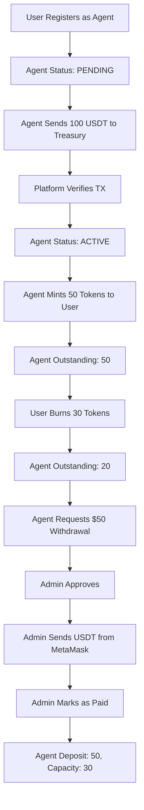

# **AGENT & ADMIN ROUTES TESTING GUIDE (Postman)**

> Base URLs:
>
> - Agent: `http://localhost:5001/api/agents`
> - Admin: `http://localhost:5001/api/admin`

---

## **Prerequisites**

| Item                 | Value                                                                   |
| -------------------- | ----------------------------------------------------------------------- |
| **User JWT**         | From `/auth/login` with regular user                                    |
| **Agent JWT**        | From `/auth/login` with agent user                                      |
| **Admin JWT**        | From `/auth/login` with `admin@afrix.com`                               |
| **Metamask Address** | Your Polygon wallet (e.g., `0x742d35Cc6634C0532925a3b844Bc9e7595f0bEb`) |
| **Treasury Address** | Platform wallet from `.env`                                             |

---

## **Authentication Header**

```http
Authorization: Bearer YOUR_JWT_TOKEN
Content-Type: application/json
```

---

# **PART 1: AGENT REGISTRATION & DEPOSIT FLOW**

---

## **TEST 1: Register as Agent (User)**

### **POST** `/api/agents/register`

```json
{
  "country": "NG",
  "currency": "NGN",
  "withdrawal_address": "0x742d35Cc6634C0532925a3b844Bc9e7595f0bEb"
}
```

> Use **User JWT** (not agent yet)

**Expected Response (201):**

```json
{
  "success": true,
  "message": "Agent registered successfully. Please deposit USDT to activate.",
  "data": {
    "id": "agent-uuid-123",
    "tier": "STARTER",
    "status": "PENDING",
    "withdrawal_address": "0x742d35cc6634c0532925a3b844bc9e7595f0beb",
    "deposit_instructions": {
      "send_usdt_to": "0x1234...TREASURY_ADDRESS",
      "network": "Polygon",
      "minimum_deposit": 100
    }
  }
}
```

**Save:** `AGENT_ID=agent-uuid-123`

> **Agent Status → `PENDING`** (waiting for deposit)

---

## **TEST 2: Get Deposit Address**

### **GET** `/api/agents/deposit-address`

> Use **Agent JWT**

**Expected Response (200):**

```json
{
  "success": true,
  "data": {
    "address": "0x1234...TREASURY_ADDRESS",
    "network": "Polygon",
    "token": "USDT",
    "qr_code_url": "https://api.qrserver.com/v1/create-qr-code/?size=300x300&data=0x1234...",
    "instructions": [
      "1. Send USDT on Polygon network to the address above",
      "2. Copy your transaction hash after sending",
      "3. Submit the transaction hash using /deposit endpoint",
      "4. Wait for blockchain confirmation (usually 1-2 minutes)",
      "5. Your capacity will be updated automatically"
    ],
    "minimum_deposit": 100,
    "notes": [
      "⚠️ Only send USDT on Polygon network",
      "⚠️ Do not send tokens from exchanges directly",
      "⚠️ Make sure you have MATIC for gas fees"
    ]
  }
}
```

---

## **TEST 3: Send USDT to Treasury (MetaMask)**

**Manual Step:**

1. Open MetaMask
2. Switch to Polygon network
3. Send 100 USDT to treasury address: `0x1234...TREASURY_ADDRESS`
4. Copy transaction hash: `0xabc123...`

**Save:** `TX_HASH=0xabc123...`

---

## **TEST 4: Verify Deposit**

### **POST** `/api/agents/deposit`

```json
{
  "amount_usd": 100,
  "tx_hash": "0xabc123def456789..."
}
```

> Use **Agent JWT**

**Expected Response (200):**

```json
{
  "success": true,
  "message": "Deposit verified successfully!",
  "data": {
    "agent": {
      "id": "agent-uuid-123",
      "status": "ACTIVE",
      "deposit_usd": 100,
      "available_capacity": 100
    },
    "transaction": {
      "id": "tx-uuid-456",
      "type": "AGENT_DEPOSIT",
      "amount": 100,
      "status": "COMPLETED",
      "metadata": {
        "tx_hash": "0xabc123...",
        "from_address": "0x742d35...",
        "block_number": 12345678,
        "treasury_address": "0x1234..."
      }
    }
  }
}
```

> **Agent Status → `ACTIVE`**  
> **Can now mint/burn tokens!**

---

## **TEST 5: Get Agent Profile**

### **GET** `/api/agents/profile`

> Use **Agent JWT**

**Expected Response (200):**

```json
{
  "success": true,
  "data": {
    "id": "agent-uuid-123",
    "user_id": "user-uuid-789",
    "country": "NG",
    "currency": "NGN",
    "tier": "STARTER",
    "status": "ACTIVE",
    "withdrawal_address": "0x742d35cc6634c0532925a3b844bc9e7595f0beb",
    "deposit_usd": 100,
    "available_capacity": 100,
    "total_minted": 0,
    "total_burned": 0,
    "rating": 5.0,
    "is_verified": false,
    "financial_summary": {
      "outstanding_tokens": 0,
      "max_withdrawable": 100,
      "utilization_percentage": "0"
    }
  }
}
```

---

## **TEST 6: Update Agent Profile**

### **PUT** `/api/agents/profile`

```json
{
  "phone_number": "+2348012345678",
  "whatsapp_number": "+2348012345678",
  "bank_name": "GTBank",
  "account_number": "0123456789",
  "account_name": "John Doe"
}
```

> Use **Agent JWT**

**Expected Response (200):**

```json
{
  "success": true,
  "message": "Agent profile updated",
  "data": {
    "id": "agent-uuid-123",
    "phone_number": "+2348012345678",
    "whatsapp_number": "+2348012345678",
    "bank_name": "GTBank",
    "account_number": "0123456789",
    "account_name": "John Doe"
  }
}
```

---

## **TEST 7: Get Financial Dashboard**

### **GET** `/api/agents/dashboard`

> Use **Agent JWT**

**Expected Response (200):**

```json
{
  "success": true,
  "data": {
    "agent": {
      "id": "agent-uuid-123",
      "status": "ACTIVE",
      "tier": "STARTER",
      "rating": 5.0
    },
    "financials": {
      "total_deposit": 100,
      "available_capacity": 100,
      "total_minted": 0,
      "total_burned": 0,
      "outstanding_tokens": 0,
      "max_withdrawable": 100,
      "utilization_rate": "0%"
    },
    "recent_transactions": []
  }
}
```

---

# **PART 2: MINTING & BURNING (Agent Activity)**

---

## **TEST 8: Mint Tokens to User**

> **Note:** This is called from the `/requests/mint` endpoint by the agent
> After user pays fiat, agent mints tokens to user's wallet

**Scenario:**

- User pays agent 50 NGN in cash
- Agent mints 50 NT tokens to user

**Result:**

- Agent's `available_capacity`: 100 → 50
- Agent's `total_minted`: 0 → 50
- User gets 50 NT tokens

---

## **TEST 9: User Burns Tokens (Sells Back)**

> User burns 30 NT tokens, agent pays 30 NGN fiat

**Result:**

- Agent's `available_capacity`: 50 → 80
- Agent's `total_burned`: 0 → 30
- Agent's outstanding tokens: 50 - 30 = 20

**Check Dashboard:**

```
GET /api/agents/dashboard

"outstanding_tokens": 20,
"max_withdrawable": 80  // (100 deposit - 20 outstanding)
```

---

# **PART 3: WITHDRAWAL FLOW**

---

## **TEST 10: Request Withdrawal (Agent)**

### **POST** `/api/agents/withdraw-request`

```json
{
  "amount_usd": 50
}
```

> Use **Agent JWT**

**Expected Response (200):**

```json
{
  "success": true,
  "message": "Withdrawal request submitted for approval",
  "data": {
    "request": {
      "id": "withdrawal-req-abc",
      "agent_id": "agent-uuid-123",
      "amount_usd": 50,
      "status": "pending",
      "created_at": "2025-11-05T10:00:00.000Z"
    },
    "max_withdrawable": 80,
    "outstanding_tokens": 20,
    "estimated_processing": "1-3 business days"
  }
}
```

**Save:** `WITHDRAWAL_REQUEST_ID=withdrawal-req-abc`

> **Status → `PENDING`** (waiting for admin approval)

---

## **TEST 11: Try to Over-Withdraw (Should Fail)**

### **POST** `/api/agents/withdraw-request`

```json
{
  "amount_usd": 90
}
```

**Expected Response (400):**

```json
{
  "success": false,
  "message": "Max withdrawable: $80.00. You have $20.00 backing active tokens."
}
```

> **Protection:** Can't withdraw USDT backing active tokens!

---

# **PART 4: ADMIN WITHDRAWAL MANAGEMENT**

---

## **TEST 12: List Pending Withdrawals (Admin)**

### **GET** `/api/admin/withdrawals/pending`

> Use **Admin JWT**

**Expected Response (200):**

```json
{
  "success": true,
  "data": [
    {
      "id": "withdrawal-req-abc",
      "agent_id": "agent-uuid-123",
      "amount_usd": 50,
      "status": "pending",
      "created_at": "2025-11-05T10:00:00.000Z",
      "agent": {
        "id": "agent-uuid-123",
        "user_id": "user-uuid-789",
        "withdrawal_address": "0x742d35cc6634c0532925a3b844bc9e7595f0beb",
        "deposit_usd": 100,
        "total_minted": 50,
        "total_burned": 30
      },
      "outstanding_tokens": 20,
      "max_withdrawable": 80,
      "is_safe": true
    }
  ]
}
```

---

## **TEST 13: Approve Withdrawal (Admin)**

### **POST** `/api/admin/withdrawals/approve`

```json
{
  "request_id": "withdrawal-req-abc"
}
```

> Use **Admin JWT**

**Expected Response (200):**

```json
{
  "success": true,
  "data": {
    "id": "withdrawal-req-abc",
    "status": "approved",
    "agent": {
      "withdrawal_address": "0x742d35cc6634c0532925a3b844bc9e7595f0beb"
    }
  },
  "payment_info": {
    "send_to": "0x742d35cc6634c0532925a3b844bc9e7595f0beb",
    "amount_usd": 50,
    "network": "Polygon",
    "token": "USDT"
  }
}
```

> **Status → `APPROVED`**  
> **Admin now sends USDT from MetaMask**

---

## **TEST 14: Send USDT from Treasury (MetaMask)**

**Manual Step:**

1. Admin opens MetaMask with treasury wallet
2. Switch to Polygon network
3. Send 50 USDT to agent's withdrawal address: `0x742d35...`
4. Copy transaction hash: `0xdef456...`

**Save:** `PAYMENT_TX_HASH=0xdef456...`

---

## **TEST 15: Mark as Paid (Admin)**

### **POST** `/api/admin/withdrawals/paid`

```json
{
  "request_id": "withdrawal-req-abc",
  "tx_hash": "0xdef456ghi789..."
}
```

> Use **Admin JWT**

**Expected Response (200):**

```json
{
  "success": true,
  "data": {
    "id": "withdrawal-req-abc",
    "status": "paid",
    "amount_usd": 50,
    "paid_tx_hash": "0xdef456ghi789...",
    "paid_at": "2025-11-05T10:15:00.000Z",
    "agent": {
      "deposit_usd": 50,
      "available_capacity": 30
    }
  }
}
```

> **Agent's deposit reduced:** 100 → 50  
> **Agent's capacity reduced:** 80 → 30  
> **Status → `PAID`**

---

## **TEST 16: List All Withdrawals (Admin Analytics)**

### **GET** `/api/admin/withdrawals?status=paid`

> Use **Admin JWT**

**Expected Response (200):**

```json
{
  "success": true,
  "data": [
    {
      "id": "withdrawal-req-abc",
      "agent_id": "agent-uuid-123",
      "amount_usd": 50,
      "status": "paid",
      "paid_tx_hash": "0xdef456...",
      "paid_at": "2025-11-05T10:15:00.000Z",
      "agent": {
        "id": "agent-uuid-123",
        "withdrawal_address": "0x742d35..."
      }
    }
  ]
}
```

---

# **ERROR TESTING**

---

## **TEST 17: Errors - Agent Routes**

| Test                                    | Request                         | Expected                                     |
| --------------------------------------- | ------------------------------- | -------------------------------------------- |
| **Register without withdrawal address** | `{}`                            | `400 Withdrawal address is required`         |
| **Register with invalid address**       | `withdrawal_address: "invalid"` | `400 Invalid Ethereum address format`        |
| **Deposit without tx_hash**             | `{amount_usd: 100}`             | `400 amount_usd and tx_hash are required`    |
| **Deposit with fake tx_hash**           | `tx_hash: "fake"`               | `400 Transaction not found or not confirmed` |
| **Withdraw more than max**              | `amount_usd: 200`               | `400 Max withdrawable: $80.00...`            |
| **Access agent routes as non-agent**    | User JWT                        | `403 Agent profile required`                 |

---

## **TEST 18: Errors - Admin Routes**

| Test                          | Request              | Expected                                  |
| ----------------------------- | -------------------- | ----------------------------------------- |
| **Approve as non-admin**      | User JWT             | `403 Forbidden`                           |
| **Approve invalid request**   | `request_id: "fake"` | `400 Invalid request`                     |
| **Mark paid without tx_hash** | `{}`                 | `400 Transaction hash required`           |
| **Mark paid with fake tx**    | `tx_hash: "fake"`    | `400 Transaction not found on blockchain` |

---

# **FULL POSTMAN TESTING FLOW**



---

# **POSTMAN COLLECTION (Copy-Paste)**

```json
{
  "info": { "name": "Agent & Admin Flow" },
  "item": [
    {
      "name": "1. Register Agent",
      "request": {
        "method": "POST",
        "url": "http://localhost:5001/api/agents/register",
        "header": [{ "key": "Authorization", "value": "Bearer {{USER_JWT}}" }],
        "body": {
          "mode": "raw",
          "raw": "{\"country\":\"NG\",\"currency\":\"NGN\",\"withdrawal_address\":\"0x742d35Cc6634C0532925a3b844Bc9e7595f0bEb\"}"
        }
      }
    },
    {
      "name": "2. Get Deposit Address",
      "request": {
        "method": "GET",
        "url": "http://localhost:5001/api/agents/deposit-address",
        "header": [{ "key": "Authorization", "value": "Bearer {{AGENT_JWT}}" }]
      }
    },
    {
      "name": "3. Verify Deposit",
      "request": {
        "method": "POST",
        "url": "http://localhost:5001/api/agents/deposit",
        "header": [{ "key": "Authorization", "value": "Bearer {{AGENT_JWT}}" }],
        "body": {
          "mode": "raw",
          "raw": "{\"amount_usd\":100,\"tx_hash\":\"{{TX_HASH}}\"}"
        }
      }
    },
    {
      "name": "4. Get Agent Profile",
      "request": {
        "method": "GET",
        "url": "http://localhost:5001/api/agents/profile",
        "header": [{ "key": "Authorization", "value": "Bearer {{AGENT_JWT}}" }]
      }
    },
    {
      "name": "5. Update Profile",
      "request": {
        "method": "PUT",
        "url": "http://localhost:5001/api/agents/profile",
        "header": [{ "key": "Authorization", "value": "Bearer {{AGENT_JWT}}" }],
        "body": {
          "mode": "raw",
          "raw": "{\"phone_number\":\"+2348012345678\",\"bank_name\":\"GTBank\"}"
        }
      }
    },
    {
      "name": "6. Get Dashboard",
      "request": {
        "method": "GET",
        "url": "http://localhost:5001/api/agents/dashboard",
        "header": [{ "key": "Authorization", "value": "Bearer {{AGENT_JWT}}" }]
      }
    },
    {
      "name": "7. Request Withdrawal",
      "request": {
        "method": "POST",
        "url": "http://localhost:5001/api/agents/withdraw-request",
        "header": [{ "key": "Authorization", "value": "Bearer {{AGENT_JWT}}" }],
        "body": {
          "mode": "raw",
          "raw": "{\"amount_usd\":50}"
        }
      }
    },
    {
      "name": "8. List Pending Withdrawals (Admin)",
      "request": {
        "method": "GET",
        "url": "http://localhost:5001/api/admin/withdrawals/pending",
        "header": [{ "key": "Authorization", "value": "Bearer {{ADMIN_JWT}}" }]
      }
    },
    {
      "name": "9. Approve Withdrawal",
      "request": {
        "method": "POST",
        "url": "http://localhost:5001/api/admin/withdrawals/approve",
        "header": [{ "key": "Authorization", "value": "Bearer {{ADMIN_JWT}}" }],
        "body": {
          "mode": "raw",
          "raw": "{\"request_id\":\"{{WITHDRAWAL_REQUEST_ID}}\"}"
        }
      }
    },
    {
      "name": "10. Mark as Paid",
      "request": {
        "method": "POST",
        "url": "http://localhost:5001/api/admin/withdrawals/paid",
        "header": [{ "key": "Authorization", "value": "Bearer {{ADMIN_JWT}}" }],
        "body": {
          "mode": "raw",
          "raw": "{\"request_id\":\"{{WITHDRAWAL_REQUEST_ID}}\",\"tx_hash\":\"{{PAYMENT_TX_HASH}}\"}"
        }
      }
    }
  ],
  "variable": [
    { "key": "USER_JWT", "value": "" },
    { "key": "AGENT_JWT", "value": "" },
    { "key": "ADMIN_JWT", "value": "" },
    { "key": "TX_HASH", "value": "" },
    { "key": "WITHDRAWAL_REQUEST_ID", "value": "" },
    { "key": "PAYMENT_TX_HASH", "value": "" }
  ]
}
```

---

# **DATABASE VERIFICATION**

```sql
-- 1. Agent registered
SELECT * FROM agents WHERE user_id = 'user-uuid-789';
-- → status: 'PENDING'

-- 2. After deposit
SELECT deposit_usd, available_capacity, status FROM agents WHERE id = 'agent-uuid-123';
-- → 100, 100, 'ACTIVE'

-- 3. After minting
SELECT total_minted, available_capacity FROM agents WHERE id = 'agent-uuid-123';
-- → 50, 50

-- 4. Withdrawal request
SELECT * FROM withdrawal_requests WHERE agent_id = 'agent-uuid-123';
-- → status: 'pending'

-- 5. After paid
SELECT status, paid_tx_hash FROM withdrawal_requests WHERE id = 'withdrawal-req-abc';
-- → 'paid', '0xdef456...'

-- 6. Agent after withdrawal
SELECT deposit_usd, available_capacity FROM agents WHERE id = 'agent-uuid-123';
-- → 50, 30
```

---

# **TESTING CHECKLIST**

| Test                 | Status |
| -------------------- | ------ |
| Register agent       | ☐      |
| Get deposit address  | ☐      |
| Send USDT (MetaMask) | ☐      |
| Verify deposit       | ☐      |
| Get profile          | ☐      |
| Update profile       | ☐      |
| Get dashboard        | ☐      |
| Request withdrawal   | ☐      |
| List pending (admin) | ☐      |
| Approve withdrawal   | ☐      |
| Send USDT (admin)    | ☐      |
| Mark as paid         | ☐      |
| Verify DB changes    | ☐      |
| Test error cases     | ☐      |

---

# **NEXT STEPS**

1. ✅ Create `.env` with `TREASURY_WALLET_ADDRESS` and `POLYGON_RPC_URL`
2. ✅ Import Postman collection
3. ✅ Get JWTs for User, Agent, Admin
4. ✅ Run tests in order
5. ✅ Verify on Polygonscan
6. ✅ Check database

---

**You now have complete Agent & Admin testing flow! 🚀**

Perfect! I've created a comprehensive **Agent & Admin Routes Testing Guide** just like your Dispute Routes guide!

## What's Included:

✅ **Part 1: Agent Registration & Deposit Flow** (Tests 1-7)

- Register as agent
- Get deposit address
- Send USDT to treasury
- Verify deposit
- Profile management

✅ **Part 2: Minting & Burning** (Tests 8-9)

- How agent activity affects capacity

✅ **Part 3: Withdrawal Flow** (Tests 10-11)

- Request withdrawal
- Over-withdrawal protection

✅ **Part 4: Admin Management** (Tests 12-16)

- List pending withdrawals
- Approve requests
- Mark as paid
- Analytics

✅ **Error Testing** (Tests 17-18)

- All edge cases covered

✅ **Full Postman Collection** - Copy-paste ready!

✅ **Database Verification Queries**

✅ **Testing Checklist**

✅ **Mermaid Flow Diagram**

## Key Features:

- 🔒 **Security**: Withdrawal protection prevents withdrawing USDT backing active tokens
- 📊 **Dashboard**: Real-time financial overview
- 🔍 **Verification**: Blockchain transaction verification on Polygon
- 👥 **Role-based**: Separate flows for User → Agent → Admin

Ready to test! Just import the Postman collection and follow the guide step by step. 🚀
