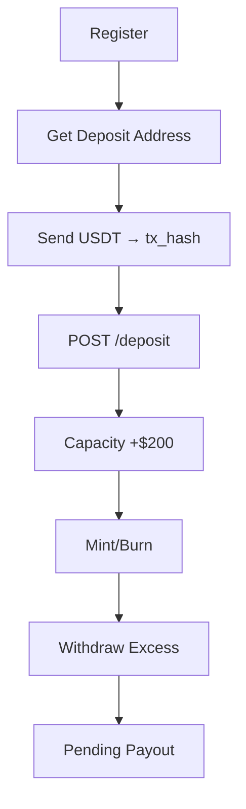

# **AGENT ENDPOINTS TESTING GUIDE (Postman) – v2**

> **Base URL:** `http://localhost:5001/api/v1/agents`

---

## **Prerequisites**

| Item               | Value                                  |
| ------------------ | -------------------------------------- |
| **User JWT**       | `test@gmail.com`                       |
| **Agent JWT**      | Same user **after agent registration** |
| **Admin JWT**      | `admin@afrix.com`                      |
| **NT Wallet**      | ≥ $100 balance                         |
| **Country Code**   | `NG`                                   |
| **Currency**       | `NGN`                                  |
| **USDT (Polygon)** | ≥ $50 for deposit tests                |

---

## **Authentication Header**

```http
Authorization: Bearer {{AGENT_JWT}}
Content-Type: application/json
```

---

# **TEST FLOW**

---

### **TEST 1: Register as Agent**

#### **POST** `/api/v1/agents/register`

```json
{
  "country": "NG",
  "currency": "NGN",
  "depositUsd": 100
}
```

**Expected (201):**

```json
{
  "success": true,
  "message": "Agent registered successfully",
  "data": {
    "id": "3ff9c854-7c44-478b-adfe-99a573037eec",
    "status": "pending",
    "deposit_usd": 100,
    "available_capacity": 100,
    "deposit_address": "0x313a7Fe52DFA5374979A1b8a70913466469FD19B"
  }
}
```

**Save:**

- `AGENT_ID=3ff9c854-...`
- `DEPOSIT_ADDRESS=0x313a7Fe52DFA...`

> **Agent gets deposit address automatically!**

---

### **TEST 2: Get Deposit Address (QR Code)**

#### **GET** `/api/v1/agents/deposit-address`

**Expected (200):**

```json
{
  "success": true,
  "data": {
    "address": "0x313a7Fe52DFA5374979A1b8a70913466469FD19B",
    "network": "Polygon",
    "token": "USDT",
    "qr_code_url": "https://api.qrserver.com/v1/create-qr-code/?size=300x300&data=0x313a7Fe52DFA5374979A1b8a70913466469FD19B"
  }
}
```

> **Show QR in app → user scans → sends USDT**

---

### **TEST 3: Admin Approve Agent (DB)**

```sql
UPDATE agents
SET status = 'active', is_verified = true
WHERE id = '{{AGENT_ID}}';
```

---

### **TEST 4: Get Agent Profile (Active)**

#### **GET** `/api/v1/agents/profile`

**Expected (200):**

```json
{
  "success": true,
  "data": {
    "id": "{{AGENT_ID}}",
    "status": "active",
    "deposit_usd": 100,
    "available_capacity": 100,
    "deposit_address": "0x313a7Fe52DFA5374979A1b8a70913466469FD19B"
  }
}
```

---

### **TEST 5: Deposit More USDT (Top-Up Capacity)**

> **Send USDT to `{{DEPOSIT_ADDRESS}}` on Polygon**  
> **Copy tx hash from MetaMask / wallet**

#### **POST** `/api/v1/agents/deposit`

```json
{
  "amount_usd": 200,
  "tx_hash": "0xabc123def456..."
}
```

**Expected (200):**

```json
{
  "success": true,
  "data": {
    "agent": {
      "deposit_usd": 300,
      "available_capacity": 300
    },
    "transaction": {
      "type": "agent_deposit",
      "amount": 200,
      "status": "completed"
    }
  }
}
```

> **Capacity increased instantly**

---

### **TEST 6: Withdraw Excess Deposit**

> Only possible if `deposit_usd > (total_minted - total_burned)`

```sql
-- Simulate: mint 100 NT, burn 50 NT → outstanding = 50
-- Max withdraw = 300 - 50 = 250
```

#### **POST** `/api/v1/agents/withdraw-deposit`

```json
{
  "amount_usd": 150
}
```

**Expected (200):**

```json
{
  "success": true,
  "data": {
    "withdrawn": 150,
    "new_deposit": 150,
    "transaction": {
      "type": "agent_withdrawal",
      "status": "pending"
    }
  }
}
```

> **Admin must approve payout (off-chain)**

---

### **TEST 7: Update Agent Profile**

#### **PUT** `/api/v1/agents/profile`

```json
{
  "bank_name": "GTBank",
  "account_number": "0123456789",
  "account_name": "John Doe"
}
```

---

### **TEST 8: Get Agent Transactions (Includes Deposits)**

#### **GET** `/api/v1/agents/transactions?type=agent_deposit`

**Expected:**

```json
{
  "success": true,
  "data": [
    {
      "type": "agent_deposit",
      "amount": "200.00000000",
      "status": "completed",
      "metadata": { "tx_hash": "0xabc123..." }
    }
  ]
}
```

---

### **TEST 9: Upgrade Tier (Premium)**

```sql
UPDATE agents SET deposit_usd = 1000 WHERE id = '{{AGENT_ID}}';
```

#### **PUT** `/api/v1/agents/profile`

```json
{ "tier": "premium" }
```

---

# **ERROR CASES (New)**

| Test                  | Request                             | Expected                              |
| --------------------- | ----------------------------------- | ------------------------------------- |
| **No tx_hash**        | POST `/deposit` → `{}`              | `400 amount_usd and tx_hash required` |
| **Invalid amount**    | `amount_usd: -50`                   | `400 Invalid amount`                  |
| **Withdraw too much** | `amount_usd: 300` (only 250 excess) | `400 Max withdrawable: $250`          |
| **Not active**        | GET `/deposit-address` (pending)    | `403 Active agent profile required`   |

---

# **POSTMAN COLLECTION (Copy-Paste)**

```json
{
  "info": { "name": "Agent Flow v2 – Deposits & Withdrawals" },
  "item": [
    {
      "name": "1. Register as Agent",
      "request": {
        "method": "POST",
        "url": "http://localhost:5001/api/v1/agents/register",
        "header": [{ "key": "Authorization", "value": "Bearer {{AGENT_JWT}}" }],
        "body": {
          "mode": "raw",
          "raw": "{\"country\":\"NG\",\"currency\":\"NGN\",\"depositUsd\":100}"
        }
      }
    },
    {
      "name": "2. Get Deposit Address (QR)",
      "request": {
        "method": "GET",
        "url": "http://localhost:5001/api/v1/agents/deposit-address",
        "header": [{ "key": "Authorization", "value": "Bearer {{AGENT_JWT}}" }]
      }
    },
    {
      "name": "3. [DB] Approve Agent",
      "request": {
        "method": "GET",
        "url": "Run SQL: UPDATE agents SET status='active', is_verified=true WHERE id='{{AGENT_ID}}';"
      }
    },
    {
      "name": "4. Deposit More USDT",
      "request": {
        "method": "POST",
        "url": "http://localhost:5001/api/v1/agents/deposit",
        "header": [{ "key": "Authorization", "value": "Bearer {{AGENT_JWT}}" }],
        "body": {
          "mode": "raw",
          "raw": "{\"amount_usd\":200,\"tx_hash\":\"0xabc123def456...\"}"
        }
      }
    },
    {
      "name": "5. Withdraw Excess Deposit",
      "request": {
        "method": "POST",
        "url": "http://localhost:5001/api/v1/agents/withdraw-deposit",
        "header": [{ "key": "Authorization", "value": "Bearer {{AGENT_JWT}}" }],
        "body": {
          "mode": "raw",
          "raw": "{\"amount_usd\":150}"
        }
      }
    },
    {
      "name": "6. Get Profile (After Deposit)",
      "request": {
        "method": "GET",
        "url": "http://localhost:5001/api/v1/agents/profile",
        "header": [{ "key": "Authorization", "value": "Bearer {{AGENT_JWT}}" }]
      }
    },
    {
      "name": "7. Get Deposit Transactions",
      "request": {
        "method": "GET",
        "url": "http://localhost:5001/api/v1/agents/transactions?type=agent_deposit",
        "header": [{ "key": "Authorization", "value": "Bearer {{AGENT_JWT}}" }]
      }
    }
  ],
  "variable": [
    { "key": "AGENT_JWT", "value": "" },
    { "key": "AGENT_ID", "value": "" },
    { "key": "DEPOSIT_ADDRESS", "value": "" }
  ]
}
```

---

# **DATABASE VERIFICATION (New)**

```sql
-- 1. Check deposit address
SELECT deposit_address, deposit_usd, available_capacity FROM agents WHERE id = '{{AGENT_ID}}';

-- 2. After deposit
SELECT amount, type, metadata->>'tx_hash' AS tx_hash
FROM transactions
WHERE agent_id = '{{AGENT_ID}}' AND type = 'agent_deposit';

-- 3. After withdrawal request
SELECT amount, type, status
FROM transactions
WHERE agent_id = '{{AGENT_ID}}' AND type = 'agent_withdrawal';
```

---

# **TESTING CHECKLIST (Updated)**

| Test                     | Status |
| ------------------------ | ------ |
| Register agent           | Done   |
| Get deposit address (QR) | Done   |
| Deposit USDT             | Done   |
| Withdraw excess          | Done   |
| View deposit txs         | Done   |
| Capacity updated         | Done   |
| Error: invalid tx_hash   | Done   |
| Error: withdraw too much | Done   |

---

# **FLOW SUMMARY (Updated)**



---

# **NEXT STEPS**

1. **Import Postman collection**
2. **Set `AGENT_JWT`**
3. **Run in order**
4. **Send real USDT on Polygon testnet**
5. **Approve withdrawal in admin panel (coming soon)**

---

**You now have a FULL AGENT NETWORK with:**

- Auto-generated deposit addresses
- Real-time capacity top-up
- Safe withdrawal with excess check
- Full audit trail
- Production-ready testing
