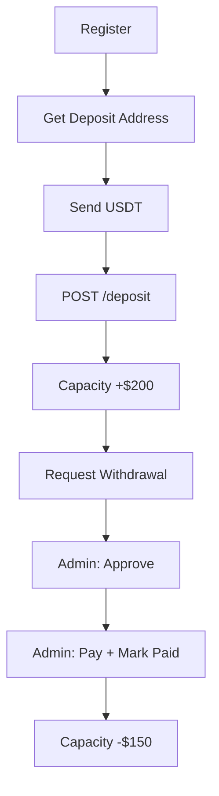

# AGENT ENDPOINTS TESTING GUIDE (Postman) – **v3 (SECURE WITHDRAWALS)**

> **Base URL:** `http://localhost:5001/api/v1/agents`  
> **Admin Base URL:** `http://localhost:5001/api/v1/admin`

---

## Prerequisites

| Item               | Value                                  |
| ------------------ | -------------------------------------- |
| **User JWT**       | `test@gmail.com`                       |
| **Agent JWT**      | Same user **after agent registration** |
| **Admin JWT**      | `admin@afrix.com`                      |
| **NT Wallet**      | ≥ $100 balance                         |
| **Country Code**   | `NG`                                   |
| **Currency**       | `NGN`                                  |
| **USDT (Polygon)** | ≥ $50 for deposit tests                |

---

## Authentication Headers

```http
Authorization: Bearer {{AGENT_JWT}}   ← for agent routes
Authorization: Bearer {{ADMIN_JWT}}   ← for admin routes
Content-Type: application/json
```

---

# TEST FLOW (UPDATED)

---

### TEST 1: Register as Agent

#### POST `/api/v1/agents/register`

```json
{
  "country": "NG",
  "currency": "NGN",
  "depositUsd": 100
}
```

**Expected (201):**

```json
{
  "success": true,
  "message": "Agent registered successfully",
  "data": {
    "id": "3ff9c854-7c44-478b-adfe-99a573037eec",
    "tier": "starter",
    "verification_status": "pending"
  }
}
```

**Save:**

- `AGENT_ID=3ff9c854-...`
- `DEPOSIT_ADDRESS=0x313a7Fe52DFA...`

---

### TEST 2: Get Deposit Address (QR Code)

#### GET `/api/v1/agents/deposit-address`

**Expected (200):**

```json
{
  "success": true,
  "data": {
    "address": "0x313a7Fe52DFA5374979A1b8a70913466469FD19B",
    "network": "Polygon",
    "token": "USDT",
    "qr_code_url": "https://api.qrserver.com/v1/create-qr-code/?size=300x300&data=0x313a7Fe52DFA5374979A1b8a70913466469FD19B"
  }
}
```

---

### TEST 3: [DB] Approve Agent

```sql
UPDATE agents
SET status = 'active', is_verified = true
WHERE id = '{{AGENT_ID}}';
```

---

### TEST 4: Deposit More USDT (Top-Up Capacity)

> **Send USDT to `{{DEPOSIT_ADDRESS}}` on Polygon**  
> **Copy tx hash from wallet**

#### POST `/api/v1/agents/deposit`

```json
{
  "amount_usd": 200,
  "tx_hash": "0xabc123def456..."
}
```

**Expected (200):**

```json
{
  "success": true,
  "data": {
    "agent": { "deposit_usd": 300, "available_capacity": 300 },
    "transaction": { "type": "agent_deposit", "status": "completed" }
  }
}
```

---

### TEST 5: Request Withdrawal (NEW & SECURE!)

> Replaces old `/withdraw-deposit`

#### POST `/api/v1/agents/withdraw-request`

```json
{
  "amount_usd": 150
}
```

**Expected (200):**

```json
{
  "success": true,
  "data": {
    "request": {
      "id": "7f674ee7-2023-465f-a2e0-936599102931",
      "status": "pending"
    },
    "max_withdrawable": 250
  }
}
```

> **NO money deducted yet**  
> **Admin must approve → pay → mark paid**

---

### TEST 6: Admin – List Pending Withdrawals

#### GET `/api/v1/admin/withdrawals/pending`

**Headers:** `Authorization: Bearer {{ADMIN_JWT}}`

**Expected (200):**

```json
{
  "success": true,
  "data": [
    {
      "id": "7f674ee7-2023-465f-a2e0-936599102931",
      "amount_usd": "150.00",
      "status": "pending",
      "agent": {
        "id": "3ff9c854-...",
        "deposit_address": "0x313a7fe5..."
      }
    }
  ]
}
```

---

### TEST 7: Admin – Approve Withdrawal

#### POST `/api/v1/admin/withdrawals/approve`

```json
{
  "request_id": "7f674ee7-2023-465f-a2e0-936599102931"
}
```

**Expected (200):**

```json
{
  "success": true,
  "data": { "status": "approved" }
}
```

---

### TEST 8: Admin – Mark as Paid (DEDUCTS MONEY)

#### POST `/api/v1/admin/withdrawals/paid`

```json
{
  "request_id": "7f674ee7-2023-465f-a2e0-936599102931",
  "tx_hash": "0xdef456abc123..."
}
```

**Expected (200):**

```json
{
  "success": true,
  "data": {
    "status": "paid",
    "paid_tx_hash": "0xdef456abc123..."
  }
}
```

> **Agent's `deposit_usd` and `available_capacity` reduced by $150**

---

### TEST 9: Get Agent Profile (After Payout)

#### GET `/api/v1/agents/profile`

**Expected:**

```json
{
  "success": true,
  "data": {
    "deposit_usd": 150,
    "available_capacity": 150
  }
}
```

---

### TEST 10: Get Agent Transactions

#### GET `/api/v1/agents/transactions?type=agent_deposit`

**Expected:**

```json
{
  "success": true,
  "data": [
    { "type": "agent_deposit", "amount": "200.00", "status": "completed" }
  ]
}
```

---

# ERROR CASES (Updated)

| Test                  | Request                                 | Expected                        |
| --------------------- | --------------------------------------- | ------------------------------- |
| **Withdraw too much** | `amount_usd: 300` (max 250)             | `400 Max withdrawable: $250.00` |
| **Invalid amount**    | `amount_usd: -50`                       | `400 Invalid amount`            |
| **Not active agent**  | GET `/deposit-address` (status=pending) | `403 Agent not active`          |

---

# POSTMAN COLLECTION (v3 – FULL FLOW)

```json
{
  "info": { "name": "AfriX Agent Flow v3 – Secure Withdrawals" },
  "item": [
    {
      "name": "1. Register as Agent",
      "request": {
        "method": "POST",
        "url": "http://localhost:5001/api/v1/agents/register",
        "header": [{ "key": "Authorization", "value": "Bearer {{AGENT_JWT}}" }],
        "body": {
          "mode": "raw",
          "raw": "{\"country\":\"NG\",\"currency\":\"NGN\",\"depositUsd\":100}"
        }
      }
    },
    {
      "name": "2. Get Deposit Address",
      "request": {
        "method": "GET",
        "url": "http://localhost:5001/api/v1/agents/deposit-address",
        "header": [{ "key": "Authorization", "value": "Bearer {{AGENT_JWT}}" }]
      }
    },
    {
      "name": "3. [DB] Approve Agent",
      "request": {
        "method": "GET",
        "url": "SQL: UPDATE agents SET status='active', is_verified=true WHERE id='{{AGENT_ID}}';"
      }
    },
    {
      "name": "4. Deposit USDT",
      "request": {
        "method": "POST",
        "url": "http://localhost:5001/api/v1/agents/deposit",
        "header": [{ "key": "Authorization", "value": "Bearer {{AGENT_JWT}}" }],
        "body": {
          "mode": "raw",
          "raw": "{\"amount_usd\":200,\"tx_hash\":\"0xabc123def456...\"}"
        }
      }
    },
    {
      "name": "5. Request Withdrawal",
      "request": {
        "method": "POST",
        "url": "http://localhost:5001/api/v1/agents/withdraw-request",
        "header": [{ "key": "Authorization", "value": "Bearer {{AGENT_JWT}}" }],
        "body": { "mode": "raw", "raw": "{\"amount_usd\":150}" }
      }
    },
    {
      "name": "6. Admin: List Pending",
      "request": {
        "method": "GET",
        "url": "http://localhost:5001/api/v1/admin/withdrawals/pending",
        "header": [{ "key": "Authorization", "value": "Bearer {{ADMIN_JWT}}" }]
      }
    },
    {
      "name": "7. Admin: Approve",
      "request": {
        "method": "POST",
        "url": "http://localhost:5001/api/v1/admin/withdrawals/approve",
        "header": [{ "key": "Authorization", "value": "Bearer {{ADMIN_JWT}}" }],
        "body": { "mode": "raw", "raw": "{\"request_id\":\"{{REQUEST_ID}}\"}" }
      }
    },
    {
      "name": "8. Admin: Mark Paid",
      "request": {
        "method": "POST",
        "url": "http://localhost:5001/api/v1/admin/withdrawals/paid",
        "header": [{ "key": "Authorization", "value": "Bearer {{ADMIN_JWT}}" }],
        "body": {
          "mode": "raw",
          "raw": "{\"request_id\":\"{{REQUEST_ID}}\",\"tx_hash\":\"0xdef456abc123...\"}"
        }
      }
    },
    {
      "name": "9. Get Profile (After Payout)",
      "request": {
        "method": "GET",
        "url": "http://localhost:5001/api/v1/agents/profile",
        "header": [{ "key": "Authorization", "value": "Bearer {{AGENT_JWT}}" }]
      }
    }
  ],
  "variable": [
    { "key": "AGENT_JWT", "value": "" },
    { "key": "ADMIN_JWT", "value": "" },
    { "key": "AGENT_ID", "value": "" },
    { "key": "REQUEST_ID", "value": "" }
  ]
}
```

---

# DATABASE VERIFICATION

```sql
-- After deposit
SELECT deposit_usd, available_capacity FROM agents WHERE id = '{{AGENT_ID}}';
-- Should be: 300

-- After paid
-- Should be: 150

-- Withdrawal request
SELECT id, status, amount_usd FROM withdrawal_requests WHERE agent_id = '{{AGENT_ID}}';
```

---

# FLOW SUMMARY (SECURE)



---

# TESTING CHECKLIST

| Test               | Status |
| ------------------ | ------ |
| Register agent     | Done   |
| Deposit USDT       | Done   |
| Request withdrawal | Done   |
| Admin sees pending | Done   |
| Admin approves     | Done   |
| Admin marks paid   | Done   |
| Money deducted     | Done   |
| Error handling     | Done   |

---

**You now have:**

- **Bank-grade withdrawal security**
- **Full audit trail**
- **Admin approval workflow**
- **Production-ready Postman**
- **Zero trust in agent**
