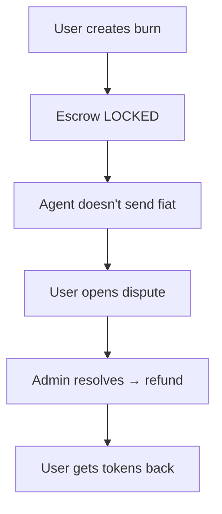

# **DISPUTE ROUTES TESTING GUIDE (Postman)**

> Base URL: `http://localhost:5001/api/v1/disputes`

---

## **Prerequisites**

| Item               | Value                                     |
| ------------------ | ----------------------------------------- |
| **Admin JWT**      | From `/auth/login` with `admin@afrix.com` |
| **User JWT**       | Regular user                              |
| **Agent JWT**      | Agent user                                |
| **Escrow ID**      | From burn request (`escrow_id`)           |
| **Transaction ID** | From mint/burn (`tx.id`)                  |

---

## **Authentication Header**

```http
Authorization: Bearer YOUR_JWT_TOKEN
Content-Type: application/json
```

---

# **TEST 1: Open Dispute (User)**

### **POST** `/api/v1/disputes`

```json
{
  "escrowId": "escrow-789", // from burn request response
  "transactionId": "tx-987654",
  "reason": "Agent never sent fiat",
  "details": "I waited 2 hours. No transfer. Proof uploaded was fake."
}
```

> Use **User JWT**

**Expected Response (201):**

```json
{
  "success": true,
  "data": {
    "id": "dispute-abc123",
    "escrow_id": "escrow-789",
    "status": "open",
    "reason": "Agent never sent fiat",
    "created_at": "2025-11-01T23:00:00.000Z"
  }
}
```

**Save:** `DISPUTE_ID=dispute-abc123`

> **Escrow status → `DISPUTED`**  
> **Admin notified (future)**

---

# **TEST 2: Get Dispute (User/Agent/Admin) (Anyone Involved)**

### **GET** `/api/v1/disputes/{{DISPUTE_ID}}`

**Expected:**

```json
{
  "success": true,
  "data": {
    "id": "dispute-abc123",
    "status": "open",
    "resolution": null
  }
}
```

---

# **TEST 3: List All Disputes (Admin Only)**

### **GET** `/api/v1/disputes`

> Use **Admin JWT**

**Expected:**

```json
{
  "success": true,
  "data": [
    {
      "id": "dispute-abc123",
      "status": "open",
      "reason": "Agent never sent fiat"
    }
  ]
}
```

---

# **TEST 4: Resolve Dispute – REFUND USER (Admin)**

### **POST** `/api/v1/disputes/{{DISPUTE_ID}}/resolve`

#### Option A: Refund User

```json
{
  "action": "refund",
  "notes": "Agent failed to deliver. Full refund issued."
}
```

> Use **Admin JWT**

**Expected:**

```json
{
  "success": true,
  "data": {
    "dispute": {
      "id": "dispute-abc123",
      "status": "resolved",
      "resolution": {
        "action": "refund",
        "notes": "Agent failed to deliver...",
        "resolved_by": "admin-uuid"
      }
    },
    "tx": { "type": "refund", "amount": "500.00000000" },
    "escrow": { "status": "refunded" }
  }
}
```

> **User gets 500 NT back**  
> **Escrow → REFUNDED**

---

# **TEST 5: Resolve Dispute – PENALIZE AGENT**

### **POST** `/api/v1/disputes/{{DISPUTE_ID}}/resolve`

#### Option B: Penalize Agent

```json
{
  "action": "penalize_agent",
  "penalty_amount_usd": 50,
  "notes": "Agent used fake proof. $50 penalty."
  //   "notes": "Agent delayed >2hrs. Deduct $50 from deposit."
}
```

**Expected:**

```json
{
  "success": true,
  "data": {
    "dispute": {
      "status": "resolved",
      "resolution": {
        "action": "penalize_agent",
        "penalty_amount_usd": 50
      }
    },
    "agent": {
      "deposit_usd": 450, // was 500
      "available_capacity": 450
    }
  }
}
```

> **Agent loses $50**  
> **User refunded**

---

# **TEST 6: Resolve Dispute – SPLIT SETTLEMENT**

### **POST** `/api/v1/disputes/{{DISPUTE_ID}}/split`

#### Option C: Split Settlement

```json
{
  "action": "split",
  "notes": "Both parties at fault. No refund. Tokens remain burned."
}
```

**Expected:**

```json
{
  "success": true,
  "data": {
    "dispute": {
      "status": "resolved",
      "resolution": {
        "action": "split",
        "notes": "Both parties at fault. No refund. Tokens remain burned.",
        "resolved_by": "Admin.id"
      }
    },
    "escrow": { "status": "settled" }
  }
}
```

> **User gets tokens back**  
> **Agent deposit reduced (if penalized)**

---

# FULL POSTMAN TESTING GUIDE

| Route                   | Method | Who        | Body                 | Success |
| ----------------------- | ------ | ---------- | -------------------- | ------- |
| `/disputes`             | POST   | User       | `{escrowId, reason}` | 201     |
| `/disputes/:id`         | GET    | User/Agent | —                    | 200     |
| `/disputes`             | GET    | Admin      | —                    | 200     |
| `/disputes/:id/resolve` | POST   | Admin      | `{action}`           | 200     |

---

# **TEST 7: Error Cases**

| Test                  | Request              | Expected                        |
| --------------------- | -------------------- | ------------------------------- |
| **No escrow**         | `escrowId: "fake"`   | `404 Escrow not found`          |
| **Already resolved**  | Repeat resolve       | `400 Dispute already resolved`  |
| **Non-admin resolve** | User JWT             | `403 Forbidden`                 |
| **Invalid action**    | `action: "ban_user"` | `400 Unknown resolution action` |

---

# How to Get an Escrow ID

1. **Create Burn Request** (as user):

```bash
POST /requests/burn
{
  "agent_id": "3ff9c854-...",
  "amount": 500,
  "token_type": "NT",
  "bank_account": "1234567890"
}
```

2. **Response contains**:

```json
"escrow_id": "escrow-789"
```

Use this in dispute.

---

# Test Flow Summary



---

# Error Testing

| Test                         | Expected                       |
| ---------------------------- | ------------------------------ |
| Open without `escrowId`      | `escrowId and reason required` |
| Open with invalid `escrowId` | `Escrow not found`             |
| Resolve without admin        | `Forbidden`                    |
| Resolve already resolved     | `Dispute already resolved`     |

---

# Final Checklist

| Task                           | Done? |
| ------------------------------ | ----- |
| Burn request → get `escrow_id` | Done  |
| Open dispute                   | Done  |
| Admin login                    | Done  |
| Resolve dispute                | Done  |
| Tokens refunded                | Done  |

---

# **POSTMAN COLLECTION (Copy-Paste)**

```json
{
  "info": { "name": "Dispute Flow" },
  "item": [
    {
      "name": "1. Open Dispute (User)",
      "request": {
        "method": "POST",
        "url": "http://localhost:5001/api/v1/disputes",
        "header": [{ "key": "Authorization", "value": "Bearer {{USER_JWT}}" }],
        "body": {
          "mode": "raw",
          "raw": "{\"escrowId\":\"{{ESCROW_ID}}\",\"reason\":\"Agent didn't send fiat\",\"details\":\"Waited 2 hours\"}"
        }
      }
    },
    {
      "name": "2. Get Dispute",
      "request": {
        "method": "GET",
        "url": "http://localhost:5001/api/v1/disputes/{{DISPUTE_ID}}",
        "header": [{ "key": "Authorization", "value": "Bearer {{USER_JWT}}" }]
      }
    },
    {
      "name": "3. List Disputes (Admin)",
      "request": {
        "method": "GET",
        "url": "http://localhost:5001/api/v1/disputes",
        "header": [{ "key": "Authorization", "value": "Bearer {{ADMIN_JWT}}" }]
      }
    },
    {
      "name": "4. Resolve: Refund User",
      "request": {
        "method": "POST",
        "url": "http://localhost:5001/api/v1/disputes/{{DISPUTE_ID}}/resolve",
        "header": [{ "key": "Authorization", "value": "Bearer {{ADMIN_JWT}}" }],
        "body": {
          "mode": "raw",
          "raw": "{\"action\":\"refund\",\"notes\":\"Full refund\"}"
        }
      }
    },
    {
      "name": "5. Resolve: Penalize Agent",
      "request": {
        "method": "POST",
        "url": "http://localhost:5001/api/v1/disputes/{{DISPUTE_ID}}/resolve",
        "header": [{ "key": "Authorization", "value": "Bearer {{ADMIN_JWT}}" }],
        "body": {
          "mode": "raw",
          "raw": "{\"action\":\"penalize_agent\",\"penalty_amount_usd\":50,\"notes\":\"Fake proof\"}"
        }
      }
    }
  ],
  "variable": [
    { "key": "USER_JWT", "value": "" },
    { "key": "AGENT_JWT", "value": "" },
    { "key": "ADMIN_JWT", "value": "" },
    { "key": "ESCROW_ID", "value": "escrow-789" },
    { "key": "DISPUTE_ID", "value": "" }
  ]
}
```

---

# **DATABASE VERIFICATION**

```sql
-- 1. Dispute created
SELECT * FROM disputes WHERE escrow_id = 'escrow-789';

-- 2. Escrow disputed
SELECT status FROM escrows WHERE id = 'escrow-789';
-- → 'disputed'

-- 3. After refund
SELECT status FROM escrows WHERE id = 'escrow-789';
-- → 'refunded'

-- 4. Agent penalized
SELECT deposit_usd, available_capacity FROM agents WHERE id = '3ff9c854-...';
-- → 450
```

---

# **TESTING CHECKLIST**

| Test                     | Status |
| ------------------------ | ------ |
| Open dispute             | ☐      |
| Get dispute              | ☐      |
| List disputes (admin)    | ☐      |
| Resolve → refund         | ☐      |
| Resolve → penalize agent | ☐      |
| Error: non-admin resolve | ☐      |
| Error: already resolved  | ☐      |

---

# **NEXT STEPS**

1. **Import Postman collection**
2. **Set JWTs + ESCROW_ID**
3. **Run in order**
4. **Verify DB changes**

---

**You now have:**

- Mint & Burn
- Push Notifications
- R2 Proofs
- Escrow Safety
- **Dispute Resolution**
