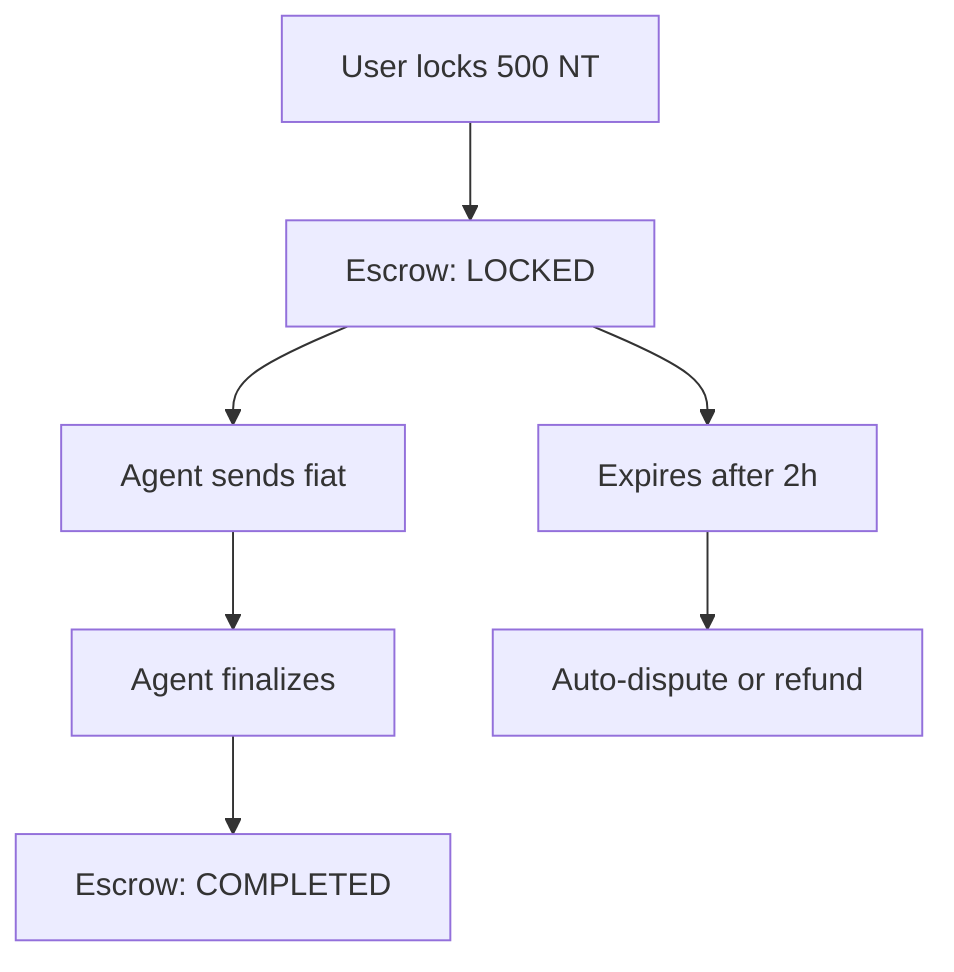

# **ESCROW ROUTES TESTING GUIDE (Postman)**

> Base URL: `http://localhost:5001/api/v1/escrows`

---

## **Prerequisites**

| Item                | Value                            |
| ------------------- | -------------------------------- |
| **User JWT**        | From `test@gmail.com`            |
| **Agent JWT**       | Same user (agent profile)        |
| **Admin JWT**       | From `admin@afrix.com`           |
| **Burn Request ID** | From `/requests/burn`            |
| **Escrow ID**       | From burn response (`escrow_id`) |

---

## **Authentication Header**

```http
Authorization: Bearer YOUR_JWT_TOKEN
Content-Type: application/json
```

---

# **TEST 1: Lock Tokens for Burn (User)**

> This happens **inside** `/requests/burn` — but you can test directly.

### **POST** `/api/v1/escrows/lock`

```json
{
  "agent_id": "3ff9c854-7c44-478b-adfe-99a573037eec",
  "token_type": "NT",
  "amount": "500",
  "metadata": {
    "bank_account": "1234567890"
  }
}
```

> Use **User JWT**

**Expected Response (201):**

```json
{
  "success": true,
  "data": {
    "transaction": {
      "id": "tx-abc123",
      "type": "burn",
      "status": "pending",
      "amount": "500.00000000"
    },
    "escrow": {
      "id": "escrow-789",
      "status": "locked",
      "amount": "500.00000000",
      "expires_at": "2025-11-02T02:00:00.000Z"
    }
  }
}
```

**Save:**

- `ESCROW_ID=escrow-789`
- `TX_ID=tx-abc123`

> **User balance → -500**  
> **Pending balance → +500**

---

# **TEST 2: Get Escrow**

### **GET** `/api/v1/escrows/{{ESCROW_ID}}`

**Expected:**

```json
{
  "success": true,
  "data": {
    "id": "escrow-789",
    "status": "locked",
    "amount": "500.00000000",
    "from_user_id": "8f054d49-...",
    "agent_id": "3ff9c854-..."
  }
}
```

---

# **TEST 3: Finalize Burn (Agent)**

> Agent confirms fiat sent → **burn tokens**

### **POST** `/api/v1/escrows/{{ESCROW_ID}}/finalize`

```json
{
  "bank_reference": "TRF987654",
  "proof_url": "https://r2.dev/burn-proofs/abc.jpg"
}
```

> Use **Agent JWT**

**Expected:**

```json
{
  "success": true,
  "data": {
    "tx": {
      "id": "tx-abc123",
      "status": "completed"
    },
    "escrow": {
      "id": "escrow-789",
      "status": "completed"
    }
  }
}
```

> **Pending balance → -500**  
> **Agent capacity → +500**

---

# **TEST 4: Admin Refund (Dispute Resolution)**

> Admin returns tokens to user

### **POST** `/api/v1/escrows/{{ESCROW_ID}}/refund`

```json
{
  "notes": "Agent failed to deliver. Full refund."
}
```

> Use **Admin JWT**

**Expected:**

```json
{
  "success": true,
  "data": {
    "tx": {
      "status": "refunded"
    },
    "escrow": {
      "status": "refunded"
    }
  }
}
```

> **Pending balance → -500**  
> **User balance → +500**

---

# **TEST 5: Auto-Expire Escrow (Cron Job)**

### **Run Manually**

```bash
node jobs/processExpiredEscrows.js
```

**Or call via API (if exposed):**

```http
POST /api/v1/admin/escrows/expire
Authorization: Bearer {{ADMIN_JWT}}
```

**Expected DB Changes:**

| Case               | Action           |
| ------------------ | ---------------- |
| **Agent assigned** | → Dispute opened |
| **No agent**       | → Auto-refunded  |

```sql
-- Check expired escrow
SELECT id, status, expires_at FROM escrows WHERE id = 'escrow-789';

-- Check dispute
SELECT * FROM disputes WHERE escrow_id = 'escrow-789';
```

---

# **ERROR CASES**

| Test                     | Request               | Expected                             |
| ------------------------ | --------------------- | ------------------------------------ |
| **Insufficient balance** | Lock 1000 NT          | `400 Insufficient available balance` |
| **Wrong user**           | Finalize as non-agent | `403 Forbidden`                      |
| **Already finalized**    | Finalize twice        | `400 Escrow not in locked state`     |
| **Non-admin refund**     | User calls refund     | `403 Forbidden`                      |

---

# **POSTMAN COLLECTION (Copy-Paste)**

```json
{
  "info": { "name": "Escrow Flow" },
  "item": [
    {
      "name": "1. Lock Tokens (User)",
      "request": {
        "method": "POST",
        "url": "http://localhost:5001/api/v1/escrows/lock",
        "header": [{ "key": "Authorization", "value": "Bearer {{USER_JWT}}" }],
        "body": {
          "mode": "raw",
          "raw": "{\"agent_id\":\"{{AGENT_ID}}\",\"token_type\":\"NT\",\"amount\":\"500\"}"
        }
      }
    },
    {
      "name": "2. Get Escrow",
      "request": {
        "method": "GET",
        "url": "http://localhost:5001/api/v1/escrows/{{ESCROW_ID}}",
        "header": [{ "key": "Authorization", "value": "Bearer {{USER_JWT}}" }]
      }
    },
    {
      "name": "3. Finalize Burn (Agent)",
      "request": {
        "method": "POST",
        "url": "http://localhost:5001/api/v1/escrows/{{ESCROW_ID}}/finalize",
        "header": [{ "key": "Authorization", "value": "Bearer {{AGENT_JWT}}" }],
        "body": {
          "mode": "raw",
          "raw": "{\"bank_reference\":\"TRF123\"}"
        }
      }
    },
    {
      "name": "4. Admin Refund",
      "request": {
        "method": "POST",
        "url": "http://localhost:5001/api/v1/escrows/{{ESCROW_ID}}/refund",
        "header": [{ "key": "Authorization", "value": "Bearer {{ADMIN_JWT}}" }],
        "body": {
          "mode": "raw",
          "raw": "{\"notes\":\"Full refund\"}"
        }
      }
    }
  ],
  "variable": [
    { "key": "USER_JWT", "value": "" },
    { "key": "AGENT_JWT", "value": "" },
    { "key": "ADMIN_JWT", "value": "" },
    { "key": "AGENT_ID", "value": "3ff9c854-7c44-478b-adfe-99a573037eec" },
    { "key": "ESCROW_ID", "value": "" }
  ]
}
```

---

# **DATABASE VERIFICATION**

```sql
-- 1. After lock
SELECT balance, pending_balance FROM wallets WHERE user_id = '8f054d49-...';
-- → balance: -500, pending: +500

-- 2. After finalize
SELECT status FROM transactions WHERE id = 'tx-abc123';
-- → 'completed'
SELECT status FROM escrows WHERE id = 'escrow-789';
-- → 'completed'

-- 3. After refund
SELECT status FROM escrows WHERE id = 'escrow-789';
-- → 'refunded'
SELECT balance FROM wallets WHERE user_id = '8f054d49-...';
-- → +500 (back)
```

---

# **TESTING CHECKLIST**

| Test                        | Status |
| --------------------------- | ------ |
| Lock tokens                 | ☐      |
| Get escrow                  | ☐      |
| Finalize burn               | ☐      |
| Admin refund                | ☐      |
| Auto-expire (cron)          | ☐      |
| Error: insufficient balance | ☐      |
| Error: non-agent finalize   | ☐      |

---

# **FLOW SUMMARY**



---

# **NEXT STEPS**

1. **Import Postman collection**
2. **Set JWTs + AGENT_ID**
3. **Run in order**
4. **Verify wallet & escrow DB**

---

**You now have FULL control over:**

- Mint & Burn
- R2 Proofs
- Push Notifications
- Escrow Safety
- Dispute Resolution
- **Admin Refunds**
