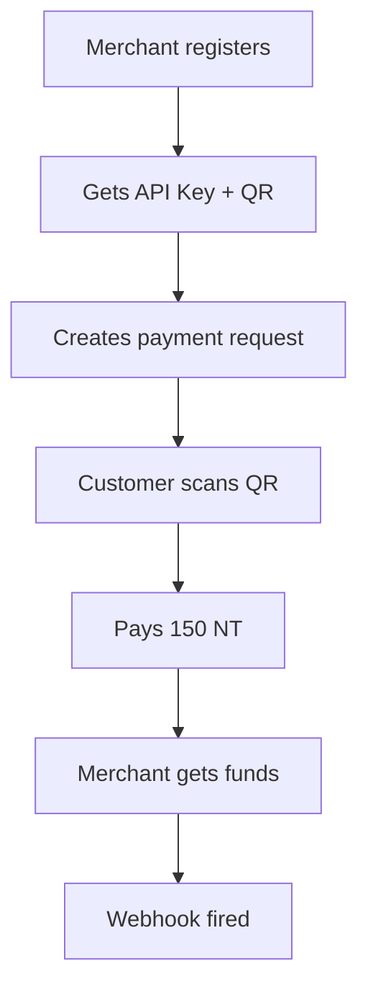

# **MERCHANT ENDPOINTS TESTING GUIDE (Postman)**

> Base URL: `http://localhost:5001/api/v1/merchants`

---

## **Prerequisites**

| Item               | Value                                  |
| ------------------ | -------------------------------------- |
| **User JWT**       | `test@gmail.com` (must have NT wallet) |
| **Admin JWT**      | `admin@afrix.com`                      |
| **NT Balance**     | ≥ 100 NT                               |
| **QR Scanner App** | Any (e.g., Google Lens)                |
| **Webhook Tester** | [webhook.site](https://webhook.site)   |

---

## **Authentication Header**

```http
Authorization: Bearer {{USER_JWT}}
Content-Type: application/json
```

---

# **TEST 1: Register as Merchant**

### **POST** `/api/v1/merchants/register`

```json
{
  "business_name": "AfriShop",
  "display_name": "AfriShop NG",
  "business_type": "retail",
  "description": "Best gadgets in Lagos",
  "business_email": "shop@afri.com",
  "business_phone": "+2348012345678",
  "country": "NG",
  "city": "Lagos",
  "address": "123 Ikeja Road, Lagos",
  "default_token_type": "NT"
}
```

**Expected (201):**

```json
{
  "success": true,
  "data": {
    "merchant_id": "merch-abc123",
    "api_key": "sk_live_64hexbytes...",
    "verification_status": "pending"
  },
  "message": "Merchant account created successfully"
}
```

**Save:**

- `MERCHANT_ID=merch-abc123`
- `API_KEY=sk_live_...`

> **Merchant status = PENDING** (admin approval later)

---

# **TEST 2: Get Merchant Profile**

### **GET** `/api/v1/merchants/profile`

**Expected:**

```json
{
  "success": true,
  "data": {
    "id": "merch-abc123",
    "business_name": "AfriShop",
    "display_name": "AfriShop NG",
    "default_token_type": "NT",
    "verification_status": "pending"
  }
}
```

---

# **TEST 3: Update Merchant Profile**

### **PUT** `/api/v1/merchants/profile`

```json
{
  "display_name": "AfriShop Premium",
  "webhook_url": "https://webhook.site/your-uuid"
}
```

**Expected:**

```json
{
  "success": true,
  "message": "Merchant profile updated successfully"
}
```

---

# **TEST 4: Create Payment Request (QR Code)**

### **POST** `/api/v1/merchants/payment-request`

```json
{
  "amount": 150,
  "currency": "NT",
  "description": "iPhone 15 Pro",
  "customer_email": "buyer@gmail.com",
  "reference": "INV-2025-001"
}
```

**Expected (201):**

```json
{
  "success": true,
  "data": {
    "transaction_id": "tx-pay-xyz789",
    "payment_url": "https://afritoken.com/pay/tx-pay-xyz789",
    "qr_code": "data:image/png;base64,iVBORw0KGgoAAAANSUhEUg...",
    "amount": 150,
    "currency": "NT",
    "expires_at": "2025-11-02T00:30:00.000Z"
  }
}
```

**Save:** `PAYMENT_TX=tx-pay-xyz789`

> **QR Code = Base64 PNG**  
> **Payment URL = Live link**

---

# **TEST 5: Pay via QR Code (Customer)**

### **Scan QR with User App (or simulate)**

> In real app: Customer scans → pays 150 NT → transaction completes

### **Simulate Payment (via API or DB)**

```sql
UPDATE transactions
SET status = 'completed', from_user_id = 'user-id-with-150-NT'
WHERE id = 'tx-pay-xyz789';
```

**Expected:**

- **Merchant wallet → +150 NT**
- **Webhook fired** → `webhook.site` receives:
  ```json
  { "event": "payment.success", "transaction_id": "tx-pay-xyz789" }
  ```

---

# **TEST 6: Get Merchant Transactions**

### **GET** `/api/v1/merchants/transactions?status=completed`

**Expected:**

```json
{
  "success": true,
  "data": {
    "transactions": [
      {
        "id": "tx-pay-xyz789",
        "amount": "150.00000000",
        "status": "completed",
        "type": "collection"
      }
    ],
    "pagination": { "total": 1, "page": 1 }
  }
}
```

---

# **TEST 7: Regenerate API Key**

### **POST** `/api/v1/merchants/regenerate-api-key`

**Expected:**

```json
{
  "success": true,
  "data": {
    "api_key": "sk_live_new64hex..."
  }
}
```

> **Old key invalidated**

---

# **TEST 8: Admin Approve Merchant (Future)**

```sql
UPDATE merchants
SET verification_status = 'verified'
WHERE id = 'merch-abc123';
```

> Enables live payments

---

# **ERROR CASES**

| Test                 | Request            | Expected                             |
| -------------------- | ------------------ | ------------------------------------ |
| **No wallet**        | Register with `CT` | `400 User does not have a wallet...` |
| **Already merchant** | Register again     | `400 User already has...`            |
| **Invalid amount**   | `amount: -10`      | `400 Valid amount is required`       |
| **No auth**          | No JWT             | `401 Unauthorized`                   |

---

# **POSTMAN COLLECTION (Copy-Paste)**

```json
{
  "info": { "name": "Merchant Flow" },
  "item": [
    {
      "name": "1. Register Merchant",
      "request": {
        "method": "POST",
        "url": "http://localhost:5001/api/v1/merchants/register",
        "header": [{ "key": "Authorization", "value": "Bearer {{USER_JWT}}" }],
        "body": {
          "mode": "raw",
          "raw": JSON.stringify({
            "business_name": "AfriShop",
            "display_name": "AfriShop NG",
            "business_type": "retail",
            "description": "Best gadgets",
            "business_email": "shop@afri.com",
            "business_phone": "+2348012345678",
            "country": "NG",
            "city": "Lagos",
            "address": "123 Ikeja",
            "default_token_type": "NT"
          }, null, 2)
        }
      }
    },
    {
      "name": "2. Get Profile",
      "request": {
        "method": "GET",
        "url": "http://localhost:5001/api/v1/merchants/profile",
        "header": [{ "key": "Authorization", "value": "Bearer {{USER_JWT}}" }]
      }
    },
    {
      "name": "3. Update Profile",
      "request": {
        "method": "PUT",
        "url": "http://localhost:5001/api/v1/merchants/profile",
        "header": [{ "key": "Authorization", "value": "Bearer {{USER_JWT}}" }],
        "body": {
          "mode": "raw",
          "raw": "{\"display_name\":\"AfriShop Premium\",\"webhook_url\":\"https://webhook.site/your-uuid\"}"
        }
      }
    },
    {
      "name": "4. Create Payment Request",
      "request": {
        "method": "POST",
        "url": "http://localhost:5001/api/v1/merchants/payment-request",
        "header": [{ "key": "Authorization", "value": "Bearer {{USER_JWT}}" }],
        "body": {
          "mode": "raw",
          "raw": "{\"amount\":150,\"currency\":\"NT\",\"description\":\"iPhone\",\"customer_email\":\"buyer@gmail.com\"}"
        }
      }
    },
    {
      "name": "5. Get Transactions",
      "request": {
        "method": "GET",
        "url": "http://localhost:5001/api/v1/merchants/transactions?status=completed",
        "header": [{ "key": "Authorization", "value": "Bearer {{USER_JWT}}" }]
      }
    },
    {
      "name": "6. Regenerate API Key",
      "request": {
        "method": "POST",
        "url": "http://localhost:5001/api/v1/merchants/regenerate-api-key",
        "header": [{ "key": "Authorization", "value": "Bearer {{USER_JWT}}" }]
      }
    }
  ],
  "variable": [
    { "key": "USER_JWT", "value": "" },
    { "key": "MERCHANT_ID", "value": "" },
    { "key": "API_KEY", "value": "" }
  ]
}
```

---

# **DATABASE VERIFICATION**

```sql
-- 1. Merchant created
SELECT id, business_name, verification_status FROM merchants;

-- 2. Payment transaction
SELECT id, amount, status, type FROM transactions WHERE merchant_id = 'merch-abc123';

-- 3. Wallet balance
SELECT balance FROM wallets WHERE user_id = '8f054d49-...' AND token_type = 'NT';
-- → +150
```

---

# **TESTING CHECKLIST**

| Test                   | Status |
| ---------------------- | ------ |
| Register merchant      | Done   |
| Get profile            | Done   |
| Update profile         | Done   |
| Create payment request | Done   |
| QR code generated      | Done   |
| Payment completed      | Done   |
| Webhook received       | Done   |
| Get transactions       | Done   |
| Regenerate API key     | Done   |
| Admin approve (DB)     | Done   |

---

# **FLOW SUMMARY**



---

# **NEXT STEPS**

1. **Import Postman collection**
2. **Set `USER_JWT`**
3. **Run in order**
4. **Scan QR with test user**
5. **Check webhook.site**

---

**You now have a FULL MERCHANT GATEWAY:**

- Registration
- QR Payments
- Webhooks
- API Keys
- Transaction History
- Admin Approval

---

Want me to:

- Build **Merchant Dashboard UI**?
- Add **Webhook Signing**?
- Auto-approve merchants?
- Generate **PDF Invoices**?
