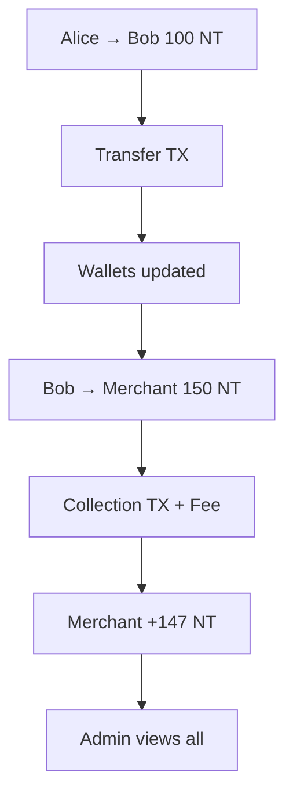

# **TRANSACTION ENDPOINTS TESTING GUIDE (Postman)**

> Base URL: `http://localhost:5001/api/v1/transactions`

---

## **Prerequisites**

| Item             | Value                        |
| ---------------- | ---------------------------- |
| **User A JWT**   | `alice@gmail.com` (≥ 500 NT) |
| **User B JWT**   | `bob@gmail.com`              |
| **Merchant JWT** | From earlier test            |
| **Agent JWT**    | Active agent                 |
| **Merchant ID**  | From `/merchants/register`   |
| **Agent ID**     | From `/agents/register`      |

---

## **Authentication Header**

```http
Authorization: Bearer {{USER_JWT}}
Content-Type: application/json
```

---

# **TEST 1: User-to-User Transfer**

### **POST** `/api/v1/transactions/transfer`

```json
{
  "to_user_id": "user-b-uuid",
  "amount": "100",
  "token_type": "NT",
  "description": "Lunch payment"
}
```

> Use **Alice JWT**

**Expected (201):**

```json
{
  "success": true,
  "data": {
    "id": "tx-transfer-123",
    "type": "transfer",
    "status": "completed",
    "amount": "100.00000000",
    "from_user_id": "alice-id",
    "to_user_id": "bob-id"
  }
}
```

**Save:** `TRANSFER_TX=tx-transfer-123`

> **Alice: -100 NT**  
> **Bob: +100 NT**

---

# **TEST 2: Pay Merchant**

### **POST** `/api/v1/transactions/pay-merchant`

```json
{
  "merchant_id": "merch-abc123",
  "amount": "150",
  "token_type": "NT",
  "description": "iPhone case"
}
```

> Use **Bob JWT**

**Expected (201):**

```json
{
  "success": true,
  "data": {
    "id": "tx-pay-xyz789",
    "type": "collection",
    "status": "completed",
    "amount": "150.00000000",
    "fee": "3.00000000", // 2% fee
    "merchant_id": "merch-abc123"
  }
}
```

> **Bob: -150 NT**  
> **Merchant: +147 NT**

---

# **TEST 3: Get Transaction by ID**

### **GET** `/api/v1/transactions/{{TRANSFER_TX}}`

**Expected:**

```json
{
  "success": true,
  "data": {
    "id": "tx-transfer-123",
    "type": "transfer",
    "status": "completed",
    "fromUser": { "full_name": "Alice" },
    "toUser": { "full_name": "Bob" }
  }
}
```

---

# **TEST 4: Verify Transaction**

### **GET** `/api/v1/transactions/{{TRANSFER_TX}}/verify`

**Expected:**

```json
{
  "success": true,
  "data": {
    "id": "tx-transfer-123",
    "status": "completed",
    "verified": true
  }
}
```

---

# **TEST 5: List Transactions (User)**

### **GET** `/api/v1/transactions?page=1&limit=5&type=transfer`

> Use **Alice JWT**

**Expected:**

```json
{
  "success": true,
  "data": {
    "transactions": [ ... ],
    "pagination": { "total": 3, "page": 1, "limit": 5 }
  }
}
```

---

# **TEST 6: List All Transactions (Admin)**

> Use **Admin JWT**

```http
GET /api/v1/transactions?status=completed
```

**Expected:** All transfers, collections, mints, burns

---

# **TEST 7: Internal Create Transaction (Admin)**

> **Warning**: Use only for testing/refunds

### **POST** `/api/v1/transactions`

```json
{
  "type": "refund",
  "amount": "50",
  "token_type": "NT",
  "from_user_id": null,
  "to_user_id": "alice-id",
  "description": "Support credit"
}
```

> Use **Admin JWT**

**Expected (201):**

```json
{
  "success": true,
  "data": { "id": "tx-refund-999", "status": "pending" }
}
```

> **Must manually complete in DB or via service**

---

# **ERROR CASES**

| Test                     | Request              | Expected                   |
| ------------------------ | -------------------- | -------------------------- |
| **Insufficient balance** | Transfer 1000 NT     | `400 Insufficient balance` |
| **Invalid user**         | `to_user_id: "fake"` | `404 Wallet not found`     |
| **Unauthorized view**    | Bob views Alice’s tx | `403 Unauthorized`         |
| **No auth**              | Any route            | `401 Unauthorized`         |

---

# **POSTMAN COLLECTION (Copy-Paste)**

```json
{
  "info": { "name": "Transaction Flow" },
  "item": [
    {
      "name": "1. User Transfer (Alice → Bob)",
      "request": {
        "method": "POST",
        "url": "http://localhost:5001/api/v1/transactions/transfer",
        "header": [{ "key": "Authorization", "value": "Bearer {{ALICE_JWT}}" }],
        "body": {
          "mode": "raw",
          "raw": "{\"to_user_id\":\"{{BOB_ID}}\",\"amount\":\"100\",\"token_type\":\"NT\",\"description\":\"Lunch\"}"
        }
      }
    },
    {
      "name": "2. Pay Merchant (Bob → AfriShop)",
      "request": {
        "method": "POST",
        "url": "http://localhost:5001/api/v1/transactions/pay-merchant",
        "header": [{ "key": "Authorization", "value": "Bearer {{BOB_JWT}}" }],
        "body": {
          "mode": "raw",
          "raw": "{\"merchant_id\":\"{{MERCHANT_ID}}\",\"amount\":\"150\",\"token_type\":\"NT\"}"
        }
      }
    },
    {
      "name": "3. Get Transaction",
      "request": {
        "method": "GET",
        "url": "http://localhost:5001/api/v1/transactions/{{TRANSFER_TX}}",
        "header": [{ "key": "Authorization", "value": "Bearer {{ALICE_JWT}}" }]
      }
    },
    {
      "name": "4. Verify Transaction",
      "request": {
        "method": "GET",
        "url": "http://localhost:5001/api/v1/transactions/{{TRANSFER_TX}}/verify",
        "header": [{ "key": "Authorization", "value": "Bearer {{ALICE_JWT}}" }]
      }
    },
    {
      "name": "5. List User Transactions",
      "request": {
        "method": "GET",
        "url": "http://localhost:5001/api/v1/transactions?type=transfer",
        "header": [{ "key": "Authorization", "value": "Bearer {{ALICE_JWT}}" }]
      }
    },
    {
      "name": "6. [Admin] List All",
      "request": {
        "method": "GET",
        "url": "http://localhost:5001/api/v1/transactions?status=completed",
        "header": [{ "key": "Authorization", "value": "Bearer {{ADMIN_JWT}}" }]
      }
    },
    {
      "name": "7. [Admin] Create Refund",
      "request": {
        "method": "POST",
        "url": "http://localhost:5001/api/v1/transactions",
        "header": [{ "key": "Authorization", "value": "Bearer {{ADMIN_JWT}}" }],
        "body": {
          "mode": "raw",
          "raw": "{\"type\":\"refund\",\"amount\":\"50\",\"token_type\":\"NT\",\"to_user_id\":\"{{ALICE_ID}}\"}"
        }
      }
    }
  ],
  "variable": [
    { "key": "ALICE_JWT", "value": "" },
    { "key": "BOB_JWT", "value": "" },
    { "key": "ADMIN_JWT", "value": "" },
    { "key": "ALICE_ID", "value": "" },
    { "key": "BOB_ID", "value": "" },
    { "key": "MERCHANT_ID", "value": "" },
    { "key": "TRANSFER_TX", "value": "" }
  ]
}
```

---

# **DATABASE VERIFICATION**

```sql
-- 1. Transfer
SELECT type, amount, from_user_id, to_user_id FROM transactions WHERE id = 'tx-transfer-123';
-- → transfer, 100, alice, bob

-- 2. Merchant payment
SELECT type, amount, fee, merchant_id FROM transactions WHERE type = 'collection';
-- → collection, 150, 3.00, merch-abc123

-- 3. Wallet balances
SELECT user_id, balance FROM wallets WHERE token_type = 'NT';
```

---

# **TESTING CHECKLIST**

| Test                        | Status |
| --------------------------- | ------ |
| User transfer               | Done   |
| Pay merchant                | Done   |
| Get transaction             | Done   |
| Verify status               | Done   |
| List user txs               | Done   |
| Admin list all              | Done   |
| Admin create tx             | Done   |
| Error: insufficient balance | Done   |
| Error: unauthorized view    | Done   |

---

# **FLOW SUMMARY**



---

# **NEXT STEPS**

1. **Import Postman collection**
2. **Set all JWTs + IDs**
3. **Run in order**
4. **Verify wallet balances**

---

**You now have a FULL TRANSACTION LEDGER:**

- P2P Transfers
- Merchant Payments (with fees)
- Mint/Burn via Agents
- Admin Refunds
- Secure Access Control
- Pagination & Filters
