# 🧠 **EDUCATION ROUTES TESTING GUIDE (Postman)**

> Base URL: `http://localhost:5001/api/v1/education`

---

## **Prerequisites**

| Item             | Description                        |
| ---------------- | ---------------------------------- |
| **User JWT**     | Token from `test@gmail.com`        |
| **Modules Enum** | Defined in `EDUCATION_MODULES`     |
| **DB Table**     | `education` (tracks progress)      |
| **Pass Score**   | From `EDUCATION_CONFIG.PASS_SCORE` |

Example module names (from your constants):

```js
WHAT_ARE_TOKENS;
HOW_AGENTS_WORK;
UNDERSTANDING_VALUE;
SAFETY_SECURITY;
```

---

## **Authentication Header**

```http
Authorization: Bearer YOUR_JWT_TOKEN
Content-Type: application/json
```

---

# **TEST 1: Get Progress**

> See your current education progress across all modules.

### **GET** `/api/v1/education/progress`

**Headers:**

```http
Authorization: Bearer {{USER_JWT}}
```

**Expected Response (200):**

```json
{
  "success": true,
  "data": {
    "WHAT_ARE_TOKENS": { "completed": false, "attempts": 0, "score": 0 },
    "HOW_AGENTS_WORK": { "completed": false, "attempts": 0, "score": 0 },
    "UNDERSTANDING_VALUE": { "completed": false, "attempts": 0, "score": 0 },
    "SAFETY_SECURITY": { "completed": false, "attempts": 0, "score": 0 }
  }
}
```

---

# **TEST 2: Get Quiz (Module)**

> Retrieve the questions for a specific module.

### **GET** `/api/v1/education/quiz/{{MODULE}}`

**Example:**

```http
GET /api/v1/education/quiz/what_are_tokens
Authorization: Bearer {{USER_JWT}}
```

**Expected Response (200):**

```json
{
  "success": true,
  "data": {
    "title": "What Are Tokens?",
    "totalQuestions": 5,
    "passingScore": 70,
    "questions": [
      {
        "question": "NT and CT are:",
        "options": [
          "Actual Naira and CFA currency",
          "Digital tokens with reference value to Naira and CFA",
          "Bitcoin or Ethereum",
          "Bank accounts"
        ]
      }
    ]
  }
}
```

> **Note:** The `questions` array has no “correct” index — for security.

---

# **TEST 3: Submit Quiz (Pass)**

> Submit correct answers to pass the module.

### **POST** `/api/v1/education/submit/{{MODULE}}`

**Example:**

```http
POST /api/v1/education/submit/WHAT_ARE_TOKENS
Authorization: Bearer {{USER_JWT}}
Content-Type: application/json
```

**Body Example (answers as 0–3):**

```json
{
  "answers": [1, 1, 1, 1, 2]
}
```

**Expected Response (200):**

```json
{
  "success": true,
  "data": {
    "score": 100,
    "correct": 5,
    "total": 5,
    "passed": true,
    "attempts_left": 2,
    "message": "Congratulations! Module completed successfully."
  }
}
```

> ✅ Record now appears in DB:
> Table: `education`
> Fields: `user_id`, `module`, `completed = true`, `score = 100`

---

# **TEST 4: Submit Quiz (Fail)**

> Try submitting wrong answers to simulate a failure.

### **POST** `/api/v1/education/submit/{{MODULE}}`

**Example:**

```http
POST /api/v1/education/submit/WHAT_ARE_TOKENS
Authorization: Bearer {{USER_JWT}}
```

**Body:**

```json
{
  "answers": [0, 0, 0, 0, 0]
}
```

**Expected Response (200):**

```json
{
  "success": true,
  "data": {
    "score": 0,
    "correct": 0,
    "total": 5,
    "passed": false,
    "attempts_left": 2,
    "message": "Need 70%. Try again!"
  }
}
```

> ⚠️ You can fail up to `EDUCATION_CONFIG.MAX_ATTEMPTS` times.

---

# **TEST 5: Max Attempts Reached**

> When a user retries more than allowed.

**Expected (403):**

```json
{
  "success": false,
  "message": "Max attempts reached"
}
```

---

# **ERROR CASES**

| Test                     | Request Example  | Expected Error               |
| ------------------------ | ---------------- | ---------------------------- |
| **Invalid module**       | `/quiz/FAKE_MOD` | `400 Invalid module`         |
| **Missing answers**      | Empty body       | `400 "answers" is required`  |
| **Wrong answer length**  | Too short array  | `400 Invalid answers format` |
| **Unauthenticated user** | No JWT header    | `401 Unauthorized`           |
| **Exceeded attempts**    | 3 failed tries   | `403 Max attempts reached`   |

---

# **DATABASE VERIFICATION**

```sql
-- View all progress
SELECT user_id, module, completed, attempts, score, completed_at
FROM education WHERE user_id = 'USER_ID';

-- Verify module completion flag on user table
SELECT education_WHAT_ARE_TOKENS FROM users WHERE id = 'USER_ID';
```

---

# **POSTMAN COLLECTION (Copy-Paste)**

```json
{
  "info": { "name": "Education Flow" },
  "item": [
    {
      "name": "1. Get Progress",
      "request": {
        "method": "GET",
        "url": "http://localhost:5001/api/v1/education/progress",
        "header": [{ "key": "Authorization", "value": "Bearer {{USER_JWT}}" }]
      }
    },
    {
      "name": "2. Get Quiz (Module)",
      "request": {
        "method": "GET",
        "url": "http://localhost:5001/api/v1/education/quiz/{{MODULE}}",
        "header": [{ "key": "Authorization", "value": "Bearer {{USER_JWT}}" }]
      }
    },
    {
      "name": "3. Submit Quiz (Pass)",
      "request": {
        "method": "POST",
        "url": "http://localhost:5001/api/v1/education/submit/{{MODULE}}",
        "header": [
          { "key": "Authorization", "value": "Bearer {{USER_JWT}}" },
          { "key": "Content-Type", "value": "application/json" }
        ],
        "body": {
          "mode": "raw",
          "raw": "{\"answers\":[1,1,1,1,2]}"
        }
      }
    },
    {
      "name": "4. Submit Quiz (Fail)",
      "request": {
        "method": "POST",
        "url": "http://localhost:5001/api/v1/education/submit/{{MODULE}}",
        "header": [
          { "key": "Authorization", "value": "Bearer {{USER_JWT}}" },
          { "key": "Content-Type", "value": "application/json" }
        ],
        "body": {
          "mode": "raw",
          "raw": "{\"answers\":[0,0,0,0,0]}"
        }
      }
    }
  ],
  "variable": [
    { "key": "USER_JWT", "value": "" },
    { "key": "MODULE", "value": "WHAT_ARE_TOKENS" }
  ]
}
```

---

# ✅ **Testing Checklist**

| Test                    | Status |
| ----------------------- | ------ |
| Get progress            | ☐      |
| Get quiz (module)       | ☐      |
| Submit quiz (pass)      | ☐      |
| Submit quiz (fail)      | ☐      |
| Max attempts (error)    | ☐      |
| Invalid module (error)  | ☐      |
| Unauthenticated (error) | ☐      |

---

# **FLOW SUMMARY**

```mermaid
graph TD
    A[GET /progress] --> B[GET /quiz/:module]
    B --> C[POST /submit/:module]
    C --> D{Score >= PASS_SCORE?}
    D -->|Yes| E[Mark completed ✅]
    D -->|No| F[Increment attempts ⚠️]
    F --> G[Try again until passed]
```


